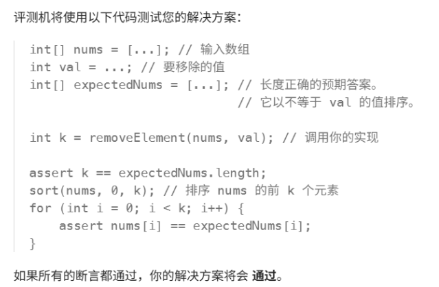

# 二分查找

总结：二分查找俩个必须条件，  1.有序 2.不重复

[704. 二分查找 - 力扣（LeetCode）](https://leetcode.cn/problems/binary-search/)

本地资料："D:\代码随想录PDF全集V3.0\1.《代码随想录》数组（V3.0）.pdf"


### 伪代码如下：

```cpp
class Solution {
public:
    int search(vector<int>& nums, int target) {

        int left=0;
        int right=nums.size()-1;
        while (left<=right){
        int middle=left+(right-left) /2;
        if(nums[middle]>target){
           right=middle-1;
           }
        else if(nums[middle]<target){
            left=middle+1;
           }
        else return middle;
        }
        return -1;
    }
};

```

### 解题心得：

    right=nums.size()-1这个我都不知道还有size，其他的还好吧


# 搜索插入位置


[35. 搜索插入位置 - 力扣（LeetCode）](https://leetcode.cn/problems/search-insert-position/description/)


### 伪代码如下

```python
class Solution:
    def searchInsert(self, nums: List[int], target: int) -> int:
        left=0 
        right=len(nums)-1
        while left<=right:
            middle=left+(right-left) // 2
            if nums[middle]>target:
                right=middle-1
            elif nums[middle]<target:
                left=middle+1
            else : return middle
        return left
```

### 解题心得

这次二分法忘记了  while left<=right:这一行代码了，看了一下题解发现了，把这个补充好之后问题就迎刃而解了，一开始没写这一行的时候我还在想  

 return left该怎么返回去呢

# 移除元素

[27. 移除元素 - 力扣（LeetCode）](https://leetcode.cn/problems/remove-element/)

本地资料："D:\代码随想录PDF全集V3.0\1.《代码随想录》数组（V3.0）.pdf"


### 伪代码如下

```python
#慢指针slow作为新数组nums的指针 
#快指针fast作为寻找值等于val的指针


class Solution:
    def removeElement(self, nums: List[int], val: int) -> int:
        slow=0
        fast=0
        while fast<len(nums):
            if nums[fast]!=val:   #找到不等于val的之后 slow+1 也就是找到多少个和val不相等的值
                nums[slow]=nums[fast]   #把不是val的值传递到新数组里
                slow=slow+1
            fast=fast+1
        return slow

```


### 解题心得：

注意他是用如下方案检验你的代码的，k是删除完元素的数组nums的长度 ，并且nums是更新过的，这个函数调用的外部nums，不存在值传递的东西


