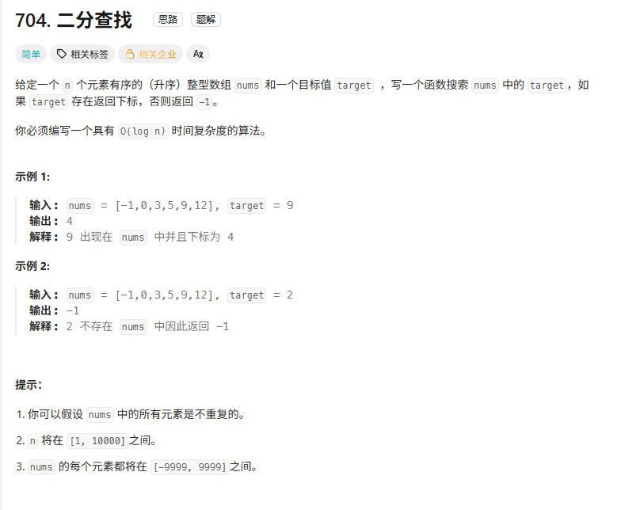
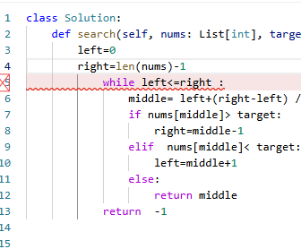
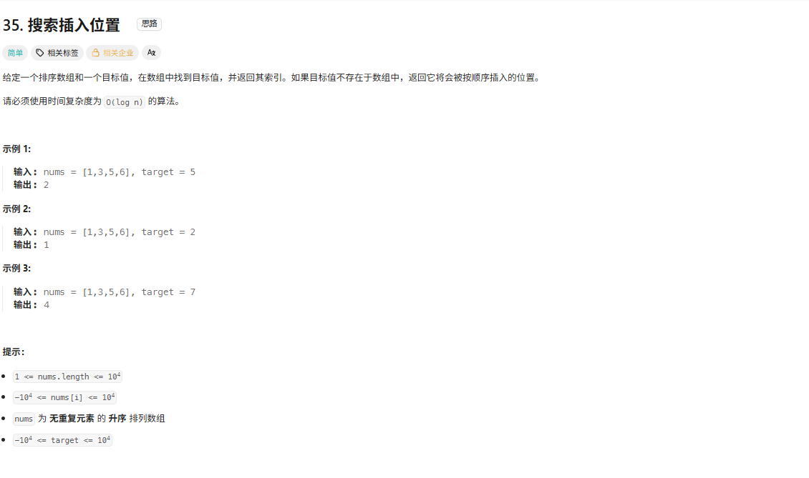
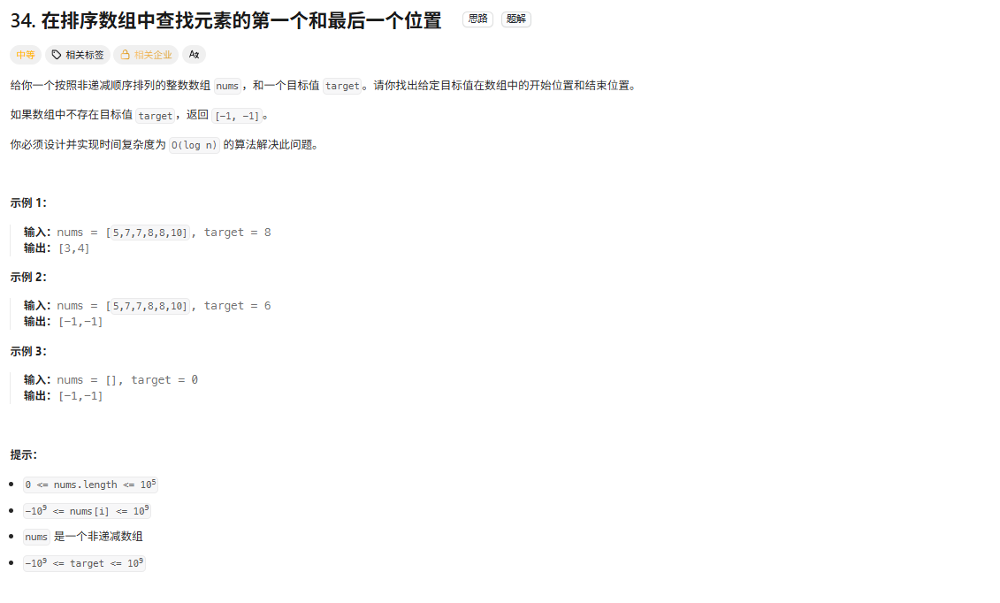
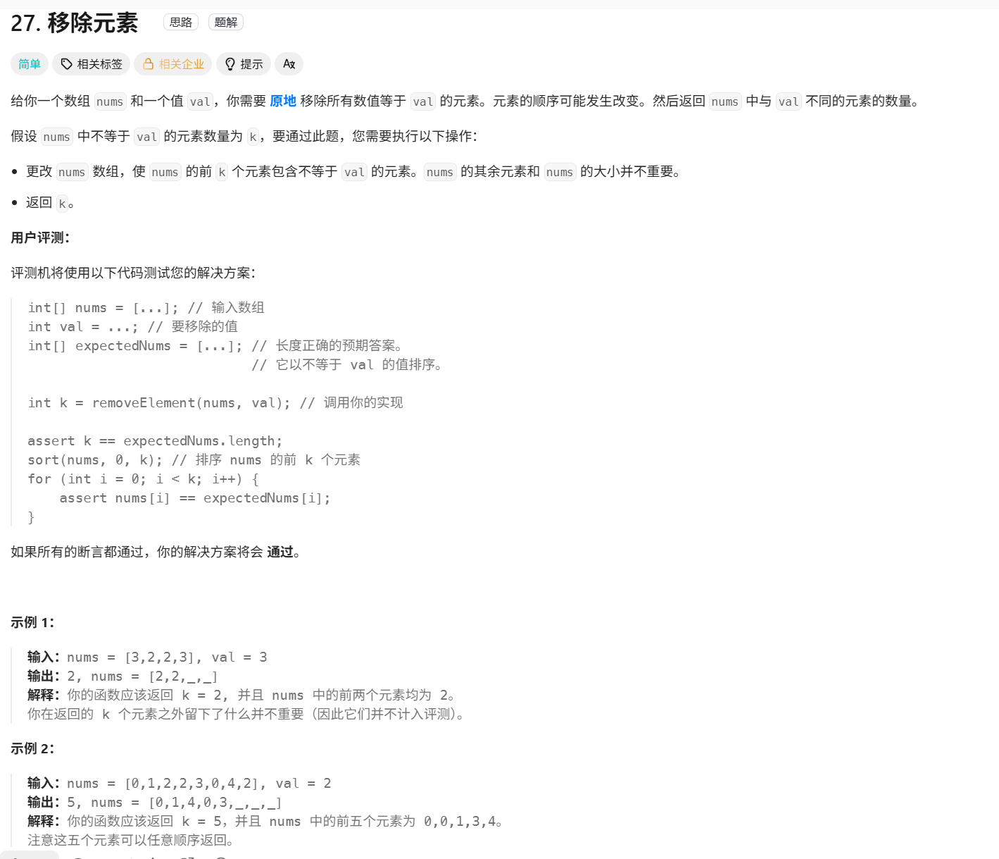

# 二分查找

总结：二分查找俩个必须条件，  1.有序 2.不重复

[704. 二分查找 - 力扣（LeetCode）](https://leetcode.cn/problems/binary-search/)

本地资料："D:\代码随想录PDF全集V3.0\1.《代码随想录》数组（V3.0）.pdf"



### 伪代码如下：

```python
class Solution:
    def search(self, nums: List[int], target: int) -> int:
        left=0
        right=len(nums)-1
        while left<=right:
          middle =left+(right-left) // 2
          if nums[middle] > target:
            right=middle-1
          elif nums[middle] <target:
            left=middle+1
          else: return middle
        return -1
```

### 解题心得：

           c++转python，还没学完python，第一次写python，导致很多地方语法不太会 比如c++的（）是python的： 以及缩进代替，并使用 `/` 计算中点，导致下标不是整数还有数组nums才是【】引用

这个while也要对齐




# 搜索插入位置


[35. 搜索插入位置 - 力扣（LeetCode）](https://leetcode.cn/problems/search-insert-position/description/)



### 伪代码如下

```python
class Solution:
    def searchInsert(self, nums: List[int], target: int) -> int:
        left=0 
        right=len(nums)-1
        while left<=right:
            middle=left+(right-left) // 2
            if nums[middle]>target:
                right=middle-1
            elif nums[middle]<target:
                left=middle+1
            else : return middle
        return left
```

### 解题心得

这次二分法忘记了  while left<=right:这一行代码了，看了一下题解发现了，把这个补充好之后问题就迎刃而解了，一开始没写这一行的时候我还在想  

 return left该怎么返回去呢

# 在排序数组中查找元素的第一个和最后一个位置

[34. 在排序数组中查找元素的第一个和最后一个位置 - 力扣（LeetCode）](https://leetcode.cn/problems/find-first-and-last-position-of-element-in-sorted-array/)



### 伪代码如下

```python
class Solution:
    def searchRange(self, nums: List[int], target: int) -> List[int]:
        #1.target不存在数组中
        #2.target存在数组中，在数组中间
        
        #寻找第一个大于等于value的函数并且是左边界   继续二分法查找左边界左边界左边界左边界左边界
        def searchFirst(value: int) -> int:
            left=0
            right=len(nums)-1
            while left<=right:
                middle = left + (right - left) // 2
                if nums[left]<value:
                    left=left+1
                else:#nums[left]>=value  找到了左边界就一直让right缩到left=right最核心的就是这个函数是找左边界的
                    right=right-1
            return left
            
        first=searchFirst(target) #寻找左边界
        if first==len(nums) or nums[first] != target:  #因为left=0，往右边开始缩，所以不要考虑左边界
            return [-1,-1]
        last=searchFirst(target+1)-1   #找到比target大的左边界，但是要减去1因为不是target，只是比target大一点
        return [first,last]

```


### 解题心得

首先就是分情况 1.找得到 2.找不到，所以先用二分看看找不找得到

思路：可以先找到左边界，在二分的基础上直接修改，左边界要保证nums[left]<value 所以找到了之后就不满足nums[left]<value了所以left就停在了左边界    

​        else:#nums[left]>=value找到左边界之后就一直让right减小直到完成while循环的条件     整个核心构造就是searchFirst函数的实现


# 移除元素

[27. 移除元素 - 力扣（LeetCode）](https://leetcode.cn/problems/remove-element/)

本地资料："D:\代码随想录PDF全集V3.0\1.《代码随想录》数组（V3.0）.pdf"




### 伪代码如下

```python
#慢指针slow作为新数组nums的指针 
#快指针fast作为寻找值等于val的指针


class Solution:
    def removeElement(self, nums: List[int], val: int) -> int:
        slow=0
        fast=0
        while fast<len(nums):
            if nums[fast]!=val:   #找到不等于val的之后 slow+1 也就是找到多少个和val不相等的值
                nums[slow]=nums[fast]   #把不是val的值传递到新数组里
                slow=slow+1
            fast=fast+1
        return slow

```


### 解题心得：

注意他是用如下方案检验你的代码的，k是删除完元素的数组nums的长度 ，并且nums是更新过的，这个函数调用的外部nums，不存在值传递的东西


