# 二叉树

1.每次写代码的时候都要先写一种就是

#### 写递归函数三要素

1.确定递归函数的参数和返回值

2.确定终止条件

3.确定单层递归逻辑


## 二叉树的前序遍历（前-中-后这个顺序写迭代）

[144. 二叉树的前序遍历 - 力扣（LeetCode）](https://leetcode.cn/problems/binary-tree-preorder-traversal/description/)

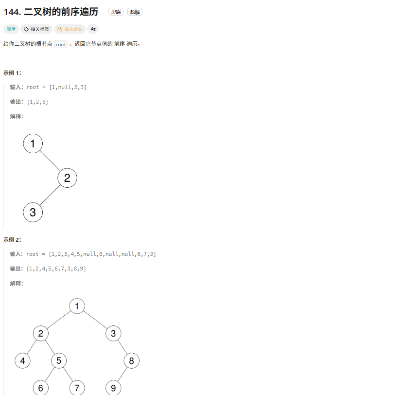


### 伪代码

```python
                                   			递归法
# Definition for a binary tree node.
# class TreeNode:
#     def __init__(self, val=0, left=None, right=None):
#         self.val = val
#         self.left = left
#         self.right = right
class Solution:
    def preorderTraversal(self, root: Optional[TreeNode]) -> List[int]:


        def dp(root):            #定义dp递归
            if not root:					#递归结束条件
                return 
            result.append(root.val) 		#中
            dp(root.left)					#左
            dp(root.right)            		#右
            
        result=[]
        dp(root)
        return result
    
    
    										迭代法
# Definition for a binary tree node.
# class TreeNode:
#     def __init__(self, val=0, left=None, right=None):
#         self.val = val
#         self.left = left
#         self.right = right
class Solution:
    def preorderTraversal(self, root: TreeNode) -> List[int]:

        stack=[] #用来存放中间的节点
        node=root #当前的中节点
        result=[]
        while node or stack: 
            while node:          #左节点遍历结束
                result.append(node.val)
                stack.append(node)
                node=node.left
            node=stack.pop()
            node=node.right
        return result

```


### 思路 

递归法：就是把根节点传进去然后直接递归左右  注意里面的顺序，中 左 右 

迭代法： 要用一个stack栈去存储当前的中间节点         node去遍历一直作为中间节点

****

### 易错点：

### 知识点：

```python
 

```


### 重写一遍之后还会犯的错

## 二叉树的后序遍历

[145. 二叉树的后序遍历 - 力扣（LeetCode）](https://leetcode.cn/problems/binary-tree-postorder-traversal/description/)

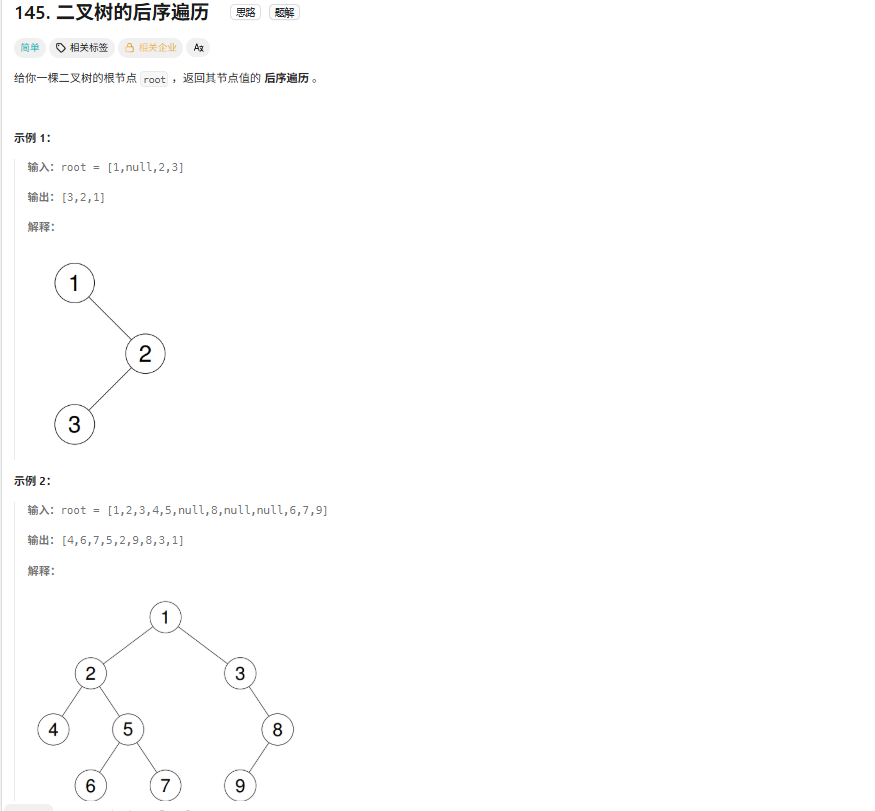

### 伪代码

```python
										中序遍历
# Definition for a binary tree node.
# class TreeNode:
#     def __init__(self, val=0, left=None, right=None):
#         self.val = val
#         self.left = left
#         self.right = right
class Solution:
    def postorderTraversal(self, root: Optional[TreeNode]) -> List[int]:
        
        result=[]          #后序：左右中

        def dp(root):
            if not root :   #递归结束条件
                return 
            dp(root.left)  				#左
            dp(root.right)				#右
            result.append(root.val)		#中
        
        dp(root)
        return result
										迭代遍历    
    
# Definition for a binary tree node.
# class TreeNode:
#     def __init__(self, val=0, left=None, right=None):
#         self.val = val
#         self.left = left
#         self.right = right
class Solution:
    def postorderTraversal(self, root: TreeNode) -> List[int]:
        result = []
        node = root
        stack = []
        prev = None                    # ★ 新增：上一个被访问的节点

        while stack or node:
            while node:
                stack.append(node)
                node=node.left

            node=stack.pop()
            if not node.right or node.right==pre : #如果没有右节点了，或者右节点已经遍历过了那就直接存下来
                result.append(node)
                pre=node
                node=None        #不设置为none的话他遍历完左右到中的时候又回去遍历左节点了
            else :               #如果有右节点，那就继续遍历
                node=node.right
                stack.append(node)

        return result


            


```


### 思路 

递归法：没有任何技巧可言

迭代法：看似很难其实一步一步写出来还挺简单的，主要是边想着二叉树边动手的话还挺快的，首先先一直往左遍历，然后判断是否有右节点，有的话就是else里面的内容：再进行遍历，直到没有右节点以及左节点的时候，就存到result当中国，！！！！pre=node！！！pre赋值为当前节点，node=none不然中间节点又去遍历左节点了，然后node.right遍历过了或者没有右节点的时候，就直接存下来

****

### 易错点：

### 知识点：

```python
 

```


### 重写一遍之后还会犯的错


## 二叉树的中序遍历

[94. 二叉树的中序遍历 - 力扣（LeetCode）](https://leetcode.cn/problems/binary-tree-inorder-traversal/)

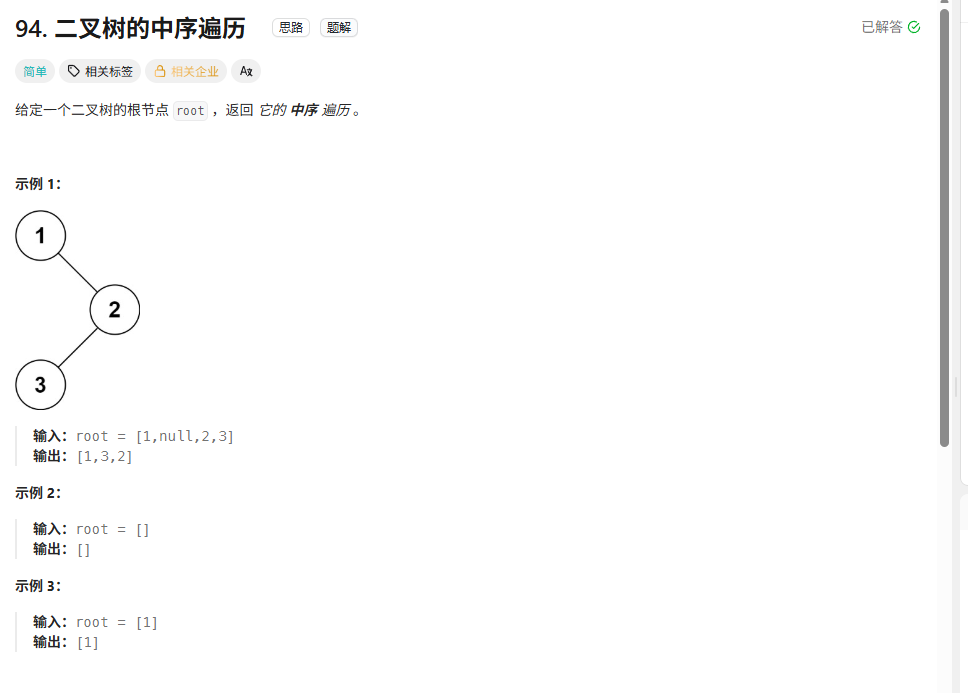

### 伪代码

```python
										递归法
# Definition for a binary tree node.
# class TreeNode:
#     def __init__(self, val=0, left=None, right=None):
#         self.val = val
#         self.left = left
#         self.right = right
class Solution:
    def inorderTraversal(self, root: TreeNode | None) -> list[int]:
        result=[]          #中序：中左右

        def dp(root):
            if not root :   #递归结束条件
                return 
            dp(root.left)               #左
            result.append(root.val)		#中
            dp(root.right)				#右
        
        dp(root)
        return result
        
        
        
        
        								迭代法
  # Definition for a binary tree node.
# class TreeNode:
#     def __init__(self, val=0, left=None, right=None):
#         self.val = val
#         self.left = left
#         self.right = right
class Solution:
    def inorderTraversal(self, root):
        result = []
        stack = []
        node = root

        while stack or node:
            while node:
                stack.append(node)      # 先压当前节点
                node = node.left        # 再往左走
            node = stack.pop()          # 左走到底，弹出栈顶
            result.append(node.val)     # 访问（左已处理完，可以访问根）
            node = node.right           # 转右

        return result  

```


### 思路

递归法：和前序的dp差不多只是换了代码顺序

迭代法： 

****

### 易错点：

当走到了最左边的节点的时候，也要看看最左边节点是否有右节点，这里两个while循环还是太超标了

### 知识点：

```python
 

```


### 重写一遍之后还会犯的错


## 二叉树层序遍历

[102. 二叉树的层序遍历 - 力扣（LeetCode）](https://leetcode.cn/problems/binary-tree-level-order-traversal/description/)

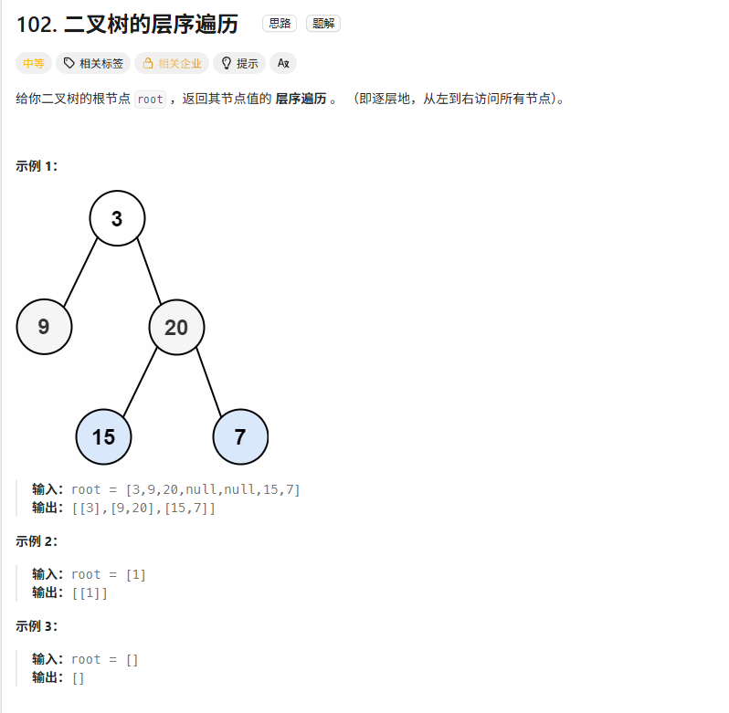

### 伪代码

```python
# Definition for a binary tree node.
# class TreeNode:
#     def __init__(self, val=0, left=None, right=None):
#         self.val = val
#         self.left = left
#         self.right = right
class Solution:
    def levelOrder(self, root: TreeNode | None) -> list[list[int]]: 
        result =[]
        if not root:
            return result
        que=deque()    #队列用来去寻找新的节点遍历
        que.append(root)

        while que:
            each_leaf=[] #保存每一层的结果
            for _ in range(0,len(que)):
                cur=que.popleft()
                each_leaf.append(cur.val)
                if  cur.left:#如果存在左右节点
                    que.append(cur.left)
                if cur.right:
                    que.append(cur.right)
            result.append(each_leaf) #把每一层的结果存到result当中
        return result
```


### 思路 

用一个队列 que 去存储扫描的节点，把他的左右节点都放进去然后， 每一层循环完用each_leaf记录下来 就记录到result当中

****

### 易错点：

### 知识点：

```python
 1.     def levelOrder(self, root: TreeNode | None) -> list[list[int]]: 
这行代码中的list[list[int]]是一个列表里面的元素都是列表，相当于是  [[5,7] , [7 ,8 ,9]]   注意这里面还是有逗号的

2.
myque = deque()#[root] 是只含一个节点的列表
myque.append(root)
        
myque = deque([root])#[root] 是只含一个节点的列表

这两行代码都是一样的，就是初始化
```


### 重写一遍之后还会犯的错


## 二叉树的层序遍历II

[107. 二叉树的层序遍历 II - 力扣（LeetCode）](https://leetcode.cn/problems/binary-tree-level-order-traversal-ii/description/)

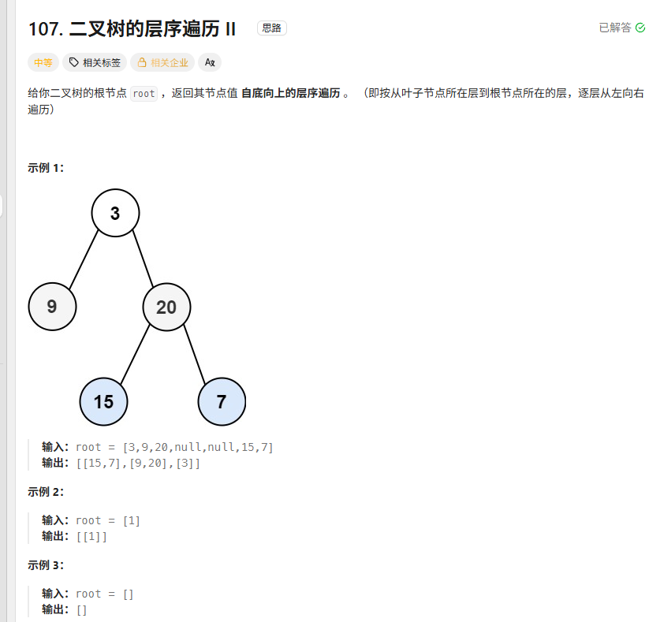


### 伪代码

```python
# Definition for a binary tree node.
# class TreeNode:
#     def __init__(self, val=0, left=None, right=None):
#         self.val = val
#         self.left = left
#         self.right = right
class Solution:
    def levelOrderBottom(self, root: TreeNode | None) -> list[list[int]]:
        result=[]   #定义结果数组
        if not root:
            return result
        que=deque() #定义队列去循环储存节点
        que.append(root) 

        while que:
            each_leaf=[]
            for _ in range(0,len(que)):
                cur=que.popleft()
                each_leaf.append(cur.val)
                if cur.left:
                    que.append(cur.left)
                if cur.right:
                    que.append(cur.right)
            result.append(each_leaf)
        result=result[::-1]
        return result
```


### 思路 

和上一题一样，加了一个翻转       result=result[::-1]

****

### 易错点：

### 知识点：

```python
 

```


### 重写一遍之后还会犯的错


## 二叉树的右视图

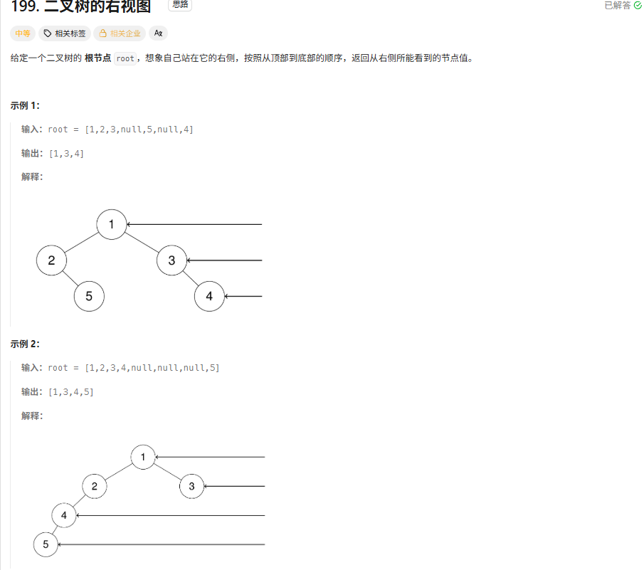

[199. 二叉树的右视图 - 力扣（LeetCode）](https://leetcode.cn/problems/binary-tree-right-side-view/description/)

### 伪代码

```python
# Definition for a binary tree node.
# class TreeNode:
#     def __init__(self, val=0, left=None, right=None):
#         self.val = val
#         self.left = left
#         self.right = right
class Solution:
    def rightSideView(self, root: Optional[TreeNode]) -> List[int]:

        result=[]   #结果数组
        if not root:
            return result

        que=deque()  #当前要循环的队列
        que.append(root)

        while que:
            each_leaf=[]  #每一层的结果
            for _ in range(0,len(que)):
                cur=que.popleft()
                each_leaf.append(cur.val)
                if cur.left:
                    que.append(cur.left)
                if cur.right:
                    que.append(cur.right)
            result.append(each_leaf[-1])
        return result

```


### 思路 

和上一题一样，只不过改了           26行 result.append(each_leaf[-1])  把最后一个存下来而已

****

### 易错点：

### 知识点：

```python
 

```


### 重写一遍之后还会犯的错


## N叉树的层序遍历

### 伪代码

```python
"""
# Definition for a Node.
class Node:
    def __init__(self, val: Optional[int] = None, children: Optional[List['Node']] = None):
        self.val = val
        self.children = children
"""

class Solution:
    def levelOrder(self, root: 'Node') -> List[List[int]]:
        result =[]      #结果数组
        if not root :
            return result

        que=deque([root])   #循环队列

        while que:
            each_leaf=[]  #存储每一层的节点
            for _ in range(0,len(que)):
                cur=que.popleft()
                each_leaf.append(cur.val)
                if cur.children:
                    for child in cur.children:
                        que.append(child)
            result.append(each_leaf)
        return result
```


### 思路

 和上一题类似，不过要注意看class的node          self.children = children  他的孩子是list类型，所以要for child in cur.children:去循环遍历他

****

### 易错点：

### 知识点：

```python
 

```


### 重写一遍之后还会犯的错


## 在每个树中找最大值

[515. 在每个树行中找最大值 - 力扣（LeetCode）](https://leetcode.cn/problems/find-largest-value-in-each-tree-row/description/)

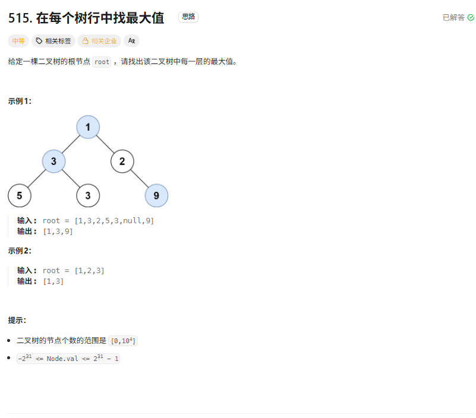

### 伪代码

```python
# Definition for a binary tree node.
# class TreeNode:
#     def __init__(self, val=0, left=None, right=None):
#         self.val = val
#         self.left = left
#         self.right = right
class Solution:
    def largestValues(self, root: TreeNode | None) -> list[int]:
        result =[]
        if not root:
            return result
        que=deque()    #队列用来去寻找新的节点遍历
        que.append(root)

        while que:
            max=float('-inf')
            for _ in range(0,len(que)):
                cur=que.popleft()
                if cur.val>max:
                    max=cur.val 
                if  cur.left:#如果存在左右节点
                    que.append(cur.left)
                if cur.right:
                    que.append(cur.right)
            result.append(max) #把每一层的结果存到result当中
        return result
```


### 思路 

和上一题类似，只不过吧each_leaf改成了max去记录

****

### 易错点：

### 知识点：

```python

```


### 重写一遍之后还会犯的错


## 填充每个节点的下一个右侧节点指针

[116. 填充每个节点的下一个右侧节点指针 - 力扣（LeetCode）](https://leetcode.cn/problems/populating-next-right-pointers-in-each-node/description/)

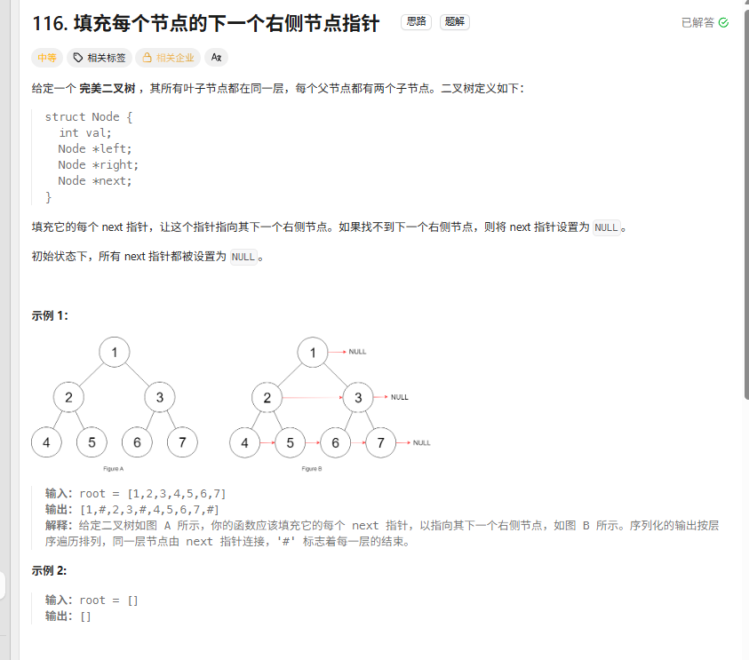

### 伪代码

```python
 """
# Definition for a Node.
class Node:
    def __init__(self, val: int = 0, left: 'Node' = None, right: 'Node' = None, next: 'Node' = None):
        self.val = val
        self.left = left
        self.right = right
        self.next = next
"""

class Solution:
    def connect(self, root: 'Optional[Node]') -> 'Optional[Node]':
        if not root:
            return root
        que=deque([root])
        
        while que:
            pre=None
            for i in range(0,len(que)):
                cur=que.popleft()
                if pre:
                    pre.next=cur
                pre=cur
                if cur.left:
                    que.append(cur.left)
                if cur.right:
                    que.append(cur.right)
            pre.next=None

        return root
            

```


### 思路 

其实差不多类似，但是有两个注意的点：

1.pre到底怎么使用，我一直在思考怎么使用，其实即可，我一直脑子没转过来

```python
                if pre:
                    pre.next=cur
                pre=cur
```

2.返回值是一个'Optional[Node]':  也就是root即可其实

****

### 易错点：

### 知识点：

```python

```


### 重写一遍之后还会犯的错


## 填充每个节点的下一个右侧节点指针II

[117. 填充每个节点的下一个右侧节点指针 II - 力扣（LeetCode）](https://leetcode.cn/problems/populating-next-right-pointers-in-each-node-ii/description/)

### 伪代码

```python
"""
# Definition for a Node.
class Node:
    def __init__(self, val: int = 0, left: 'Node' = None, right: 'Node' = None, next: 'Node' = None):
        self.val = val
        self.left = left
        self.right = right
        self.next = next
"""

class Solution:
    def connect(self, root: 'Node') -> 'Node':
        if not root:
            return root
        que=deque([root])
        
        while que:
            pre=None
            for i in range(0,len(que)):
                cur=que.popleft()
                if pre:
                    pre.next=cur
                pre=cur
                if cur.left:
                    que.append(cur.left)
                if cur.right:
                    que.append(cur.right)
            pre.next=None

        return root
            
```


### 思路 

和上一题的代码完全一样

****

### 易错点：

### 知识点：

```python
 

```


### 重写一遍之后还会犯的错


## 二叉树的最大深度

[104. 二叉树的最大深度 - 力扣（LeetCode）](https://leetcode.cn/problems/maximum-depth-of-binary-tree/)

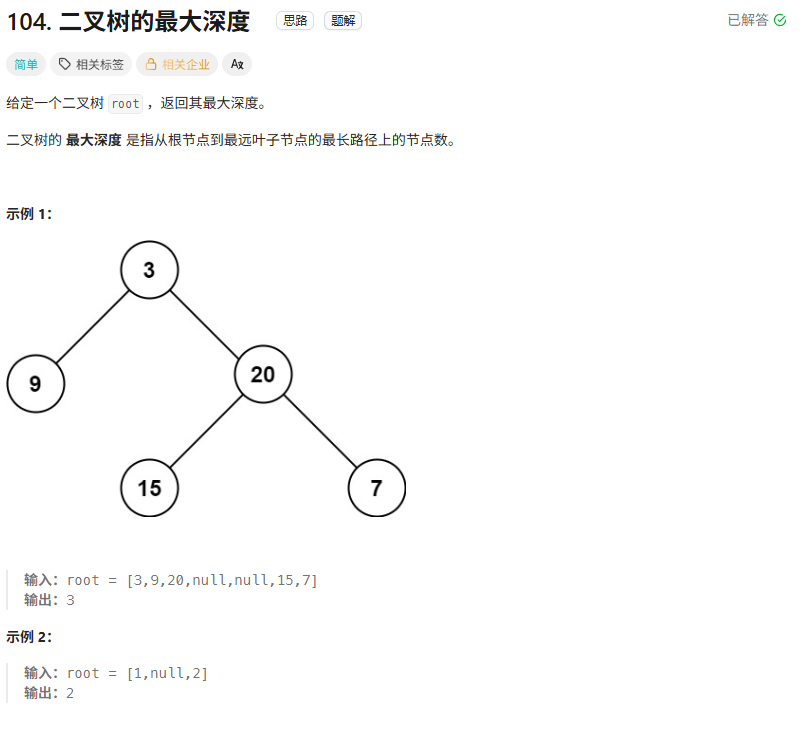

### 伪代码

```python
# Definition for a binary tree node.
# class TreeNode:
#     def __init__(self, val=0, left=None, right=None):
#         self.val = val
#         self.left = left
#         self.right = right
class Solution:
    def maxDepth(self, root: TreeNode | None) -> int:
        size=0
        if not root:
            return 0
        que=deque([root])

        while que:
            size+=1
            for _ in range(0,len(que)):
                cur=que.popleft()
                if cur.left:
                    que.append(cur.left)
                if cur.right:
                    que.append(cur.right)
        return size
```


### 思路 

用一个size记录每一层循环的次数即可

****

### 易错点：

### 知识点：

```python
 

```


### 重写一遍之后还会犯的错


## 二叉树的最小深度

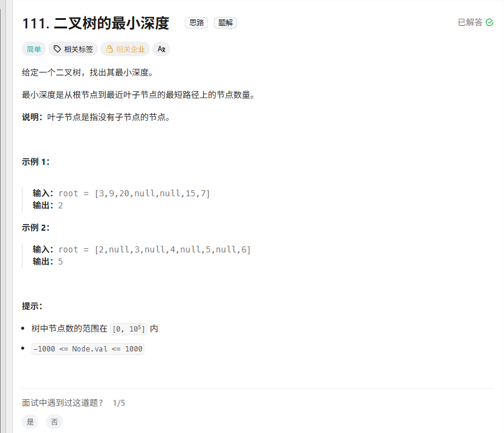


[111. 二叉树的最小深度 - 力扣（LeetCode）](https://leetcode.cn/problems/minimum-depth-of-binary-tree/)

### 伪代码

```python
# Definition for a binary tree node.
# class TreeNode:
#     def __init__(self, val=0, left=None, right=None):
#         self.val = val
#         self.left = left
#         self.right = right
class Solution:
    def minDepth(self, root: TreeNode | None) -> int:
        minsize=0
        if not  root:
            return 0
        que=deque([root])

        while que:
            minsize+=1
            for _ in range(0,len(que)):
                cur=que.popleft()
                if cur.left:
                    que.append(cur.left)
                if cur.right:
                    que.append(cur.right)
                if not cur.left and not cur.right:
                    return minsize
        return minsize
```


### 思路 

和之前一样，只不过是左右节点都没有的时候直接return minsize即可

****

### 易错点：

### 知识点：

```python
 

```


### 重写一遍之后还会犯的错


## 二叉树的层平均值

[637. 二叉树的层平均值 - 力扣（LeetCode）](https://leetcode.cn/problems/average-of-levels-in-binary-tree/description/)

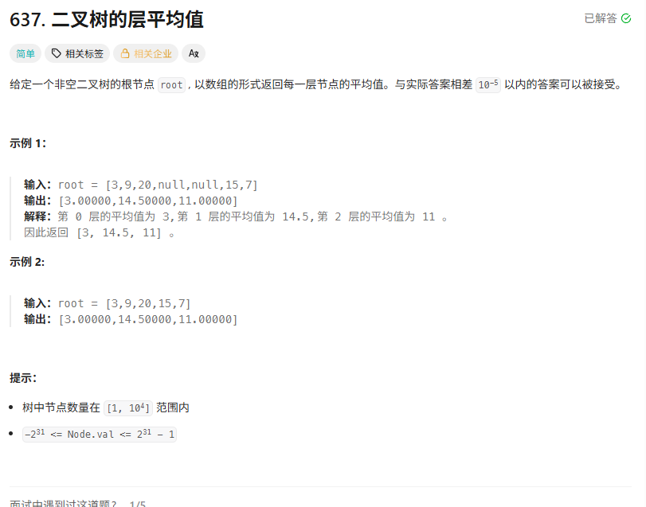

### 伪代码

```python
# Definition for a binary tree node.
# class TreeNode:
#     def __init__(self, val=0, left=None, right=None):
#         self.val = val
#         self.left = left
#         self.right = right
class Solution:
    def averageOfLevels(self, root: TreeNode | None) -> list[float]:
        result =[]
        if not root:
            return result
        que=deque()    #队列用来去寻找新的节点遍历
        que.append(root)

        while que:
            sum=0
            avg_size=0
            for _ in range(0,len(que)):
                cur=que.popleft()
                avg_size+=1
                sum+=cur.val
                if  cur.left:#如果存在左右节点
                    que.append(cur.left)
                if cur.right:
                    que.append(cur.right)
            result.append(sum/avg_size)
        return result
```


### 思路 


****

### 易错点：

就是注意每一层的sum和avg_size都要置为0

### 知识点：

```python
 

```


### 重写一遍之后还会犯的错


## 翻转二叉树

[226. 翻转二叉树 - 力扣（LeetCode）](https://leetcode.cn/problems/invert-binary-tree/)

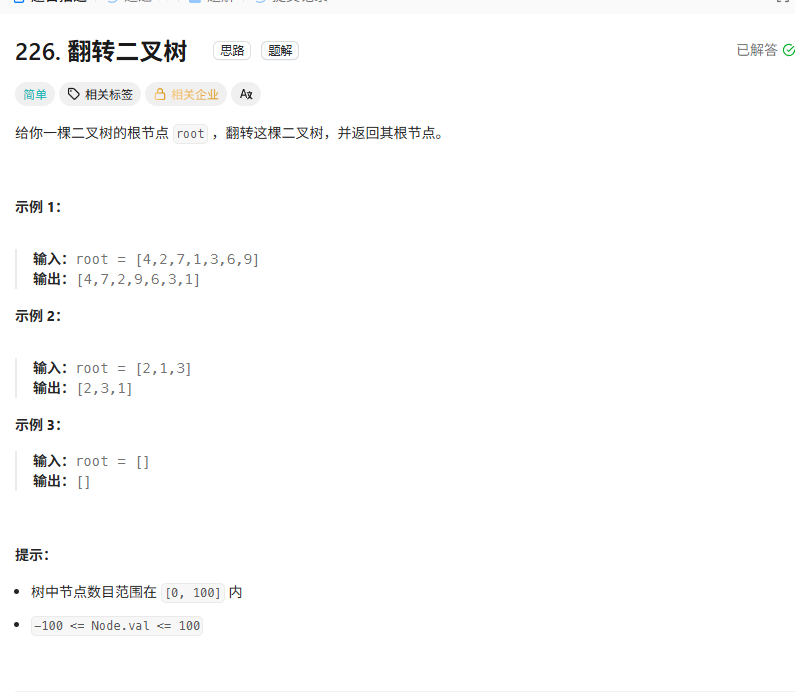


### 伪代码

```python
										1.层序法

class Solution:
    def invertTree(self, root: Optional[TreeNode]) -> Optional[TreeNode]:
        if not root:
            return root
        que=deque([root])
        while que:
            for _ in range(0,len(que)):
                cur=que.popleft()
                cur.left,cur.right=cur.right,cur.left # ✅ 无条件交换左右孩子
                
				   # 交换后把（现在的）左右孩子入队，继续往下处理
                if cur.right :
                    que.append(cur.right)
                if cur.left :
                    que.append(cur.left)                    

        return root
        
        								2.递归法
class Solution:
    def invertTree(self, root: Optional[TreeNode]) -> Optional[TreeNode]:
        if not root:
            return None
        root.left , root.right = root.right , root.left
        self.invertTree(root.left)
        self.invertTree(root.right)
        return root        
    
    
    									3.迭代法

class Solution:
    def invertTree(self, root: Optional[TreeNode]) -> Optional[TreeNode]:
        if not root:
            return None
        stack=[]
        stack.append(root)

        while stack:
            node=stack.pop()
            node.left,node.right=node.right,node.left
            if node.left:
                stack.append(node.left)
            if node.right:
                stack.append(node.right)        
        return root
```


### 思路 

层序法：无条件翻转左右节点即可

递归法： 1.确定参数还有返回值类 型 （参数root ，返回值root ）     2.  确定终止条件：        if not root:    return None   3.确定单层递归的逻辑  

迭代法：简简单单前序迭代

****

### 易错点：

### 知识点：

```python
 

```


### 重写一遍之后还会犯的错


## 对称二叉树


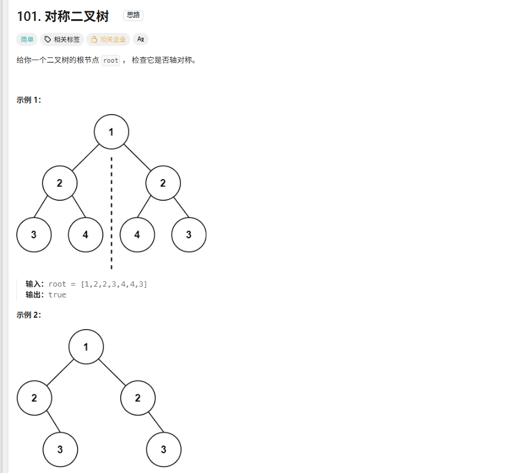


[101. 对称二叉树 - 力扣（LeetCode）](https://leetcode.cn/problems/symmetric-tree/)

### 伪代码

```python
							1.递归法
class Solution:
    def compare(self,left,right):
        if left==None and right!=None:  return False  #1.左空右不空
        elif left!=None and right==None:  return False #1.左不空右空
        elif left==None and right==None: return True  #1.左空右空
        elif left.val!=right.val: return False        #1.左右值不相等
        #到了这一步已经能判断到此刻已经对称了

        outside=self.compare(left.left,right.right)
        inside=self.compare(left.right,right.left)
        return outside and inside

    def isSymmetric(self, root: TreeNode | None) -> bool:
        if not root:
            return root
        return self.compare(root.left,root.right)
    						2.层序遍历法
        # Definition for a binary tree node.
# class TreeNode:
#     def __init__(self, val=0, left=None, right=None):
#         self.val = val
#         self.left = left
#         self.right = right
class Solution:
    def isSymmetric(self, root: TreeNode | None) -> bool:
        if not root:
            return root
        que=deque([root])

        while que:
            leaf=[]
            for _ in range(0,len(que)):
                cur=que.popleft()
                if cur:
                    leaf.append(cur.val)
                    que.append(cur.left)  #不管是不是空全部加进去
                    que.append(cur.right)
                else :
                    leaf.append(None)    #这一层leaf也要加入空节点进去
            if leaf!=leaf[::-1]:
                return  False
        return True
```


### 思路 

1.递归法：  1.传入的参数是左右要对比的节点   2.终止条件是这几个if的判断   3.单层递归逻辑用第三层去执行即可

2.层序遍历法：  空节点也要传入进去，因为也要进去判断的  ，无论是什么都要加入到leaf里面   if cur是为了把东西加入到que当中

****

### 易错点：

### 知识点：

```python
 leaf!=leaf[::-1]
    看下leaf和leaf反转之后是否一样

```


### 重写一遍之后还会犯的错


