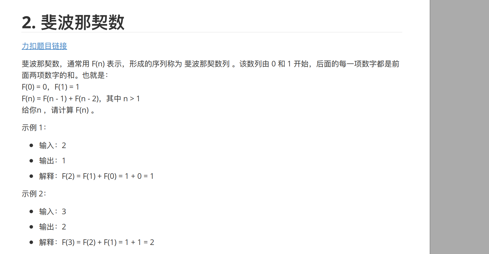
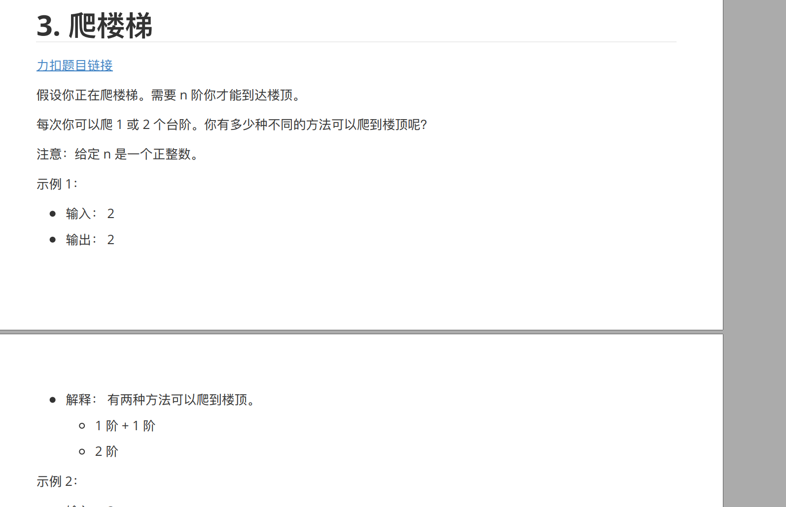
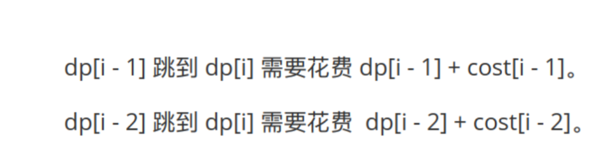

# 动态规划

### 递归

1.什么时候结束也就是终止条件

2.什么时候return

3.要python在自己的函数里面调用自己，需要加self.


## 1.斐波那契数  

https://leetcode.cn/problems/fibonacci-number/




### 伪代码

```python
###  递归法
class Solution:
    def fib(self, n: int) -> int:
        if n<2:  
            return n
        return self.fib(n-1)+self.fib(n-2)

        
        
        
        
xxxxxx代码法：
class Solution:
    def fib(self, n: int) -> int:
        if n < 2:
            return n
            
        dp = [0] * 30
        dp[0] = 0
        dp[1] = 1
        for i in range(2, n + 1):
            # 正确的滚动更新
            dp[0], dp[1] = dp[1], dp[0] + dp[1]
            
        return dp[1] # 注意：算到最后，结果存在 dp[1] 里
```

### 思路：

### 易错点：

1.要python在自己的函数里面调用自己，需要加self.

### 知识点：

这是递归的入门题： 递归有两个要素

### 再写一遍犯的错


## 爬楼梯

[70. 爬楼梯 - 力扣（LeetCode）](https://leetcode.cn/problems/climbing-stairs/description/)




### 伪代码

```python
xxxxx 递归法
	def fib(N):
        if N==1: return 1
    	if N==2 : return 2
   		return fib(N)+fib(N)
```

### 思路：

变种的斐波那契数  ， 比如10阶台阶 = 8阶的时候+9阶的时候 的值  ，  你说8阶不可以 8+1+1 和 8 +2 两种呢， 因为8+1的时候再+1中间有9的过程了


### 易错点：

### 知识点：

### 再写一遍犯的错


## 最小花费爬楼梯



### 伪代码

```python

```


### 思路 

****

### 易错点：

### 知识点：

```python
 

```


### 重写一遍之后还会犯的错