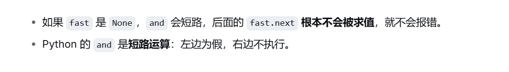
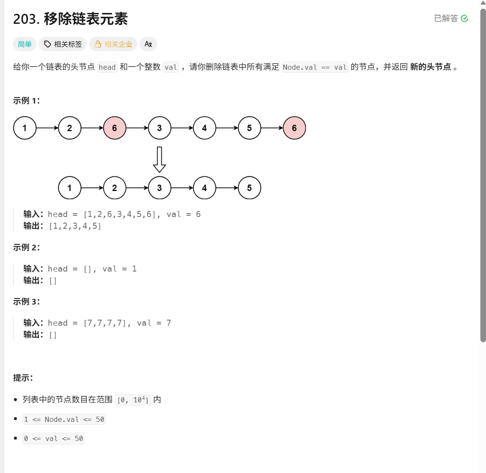
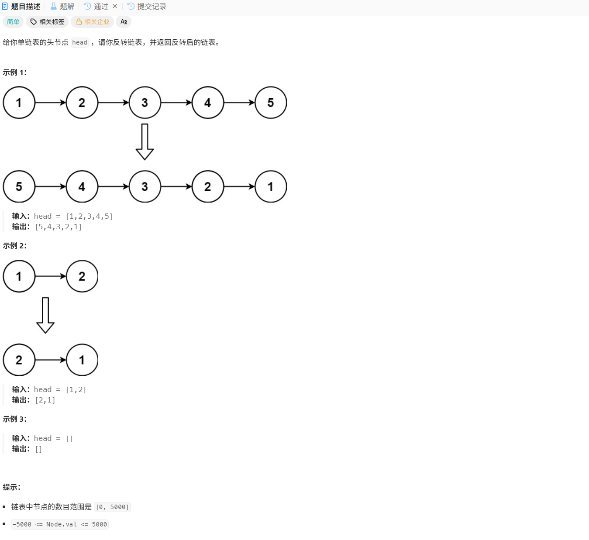
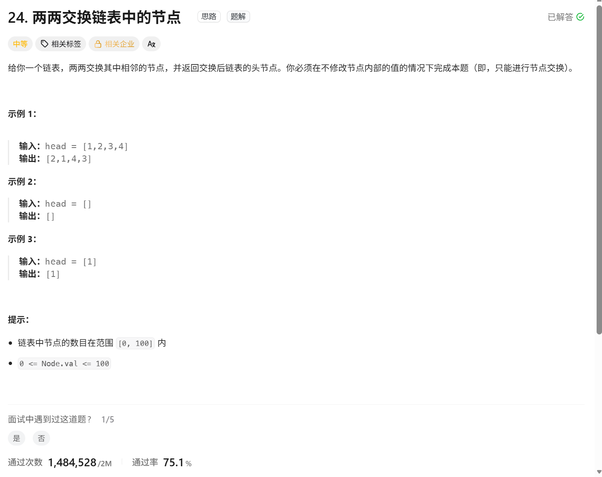
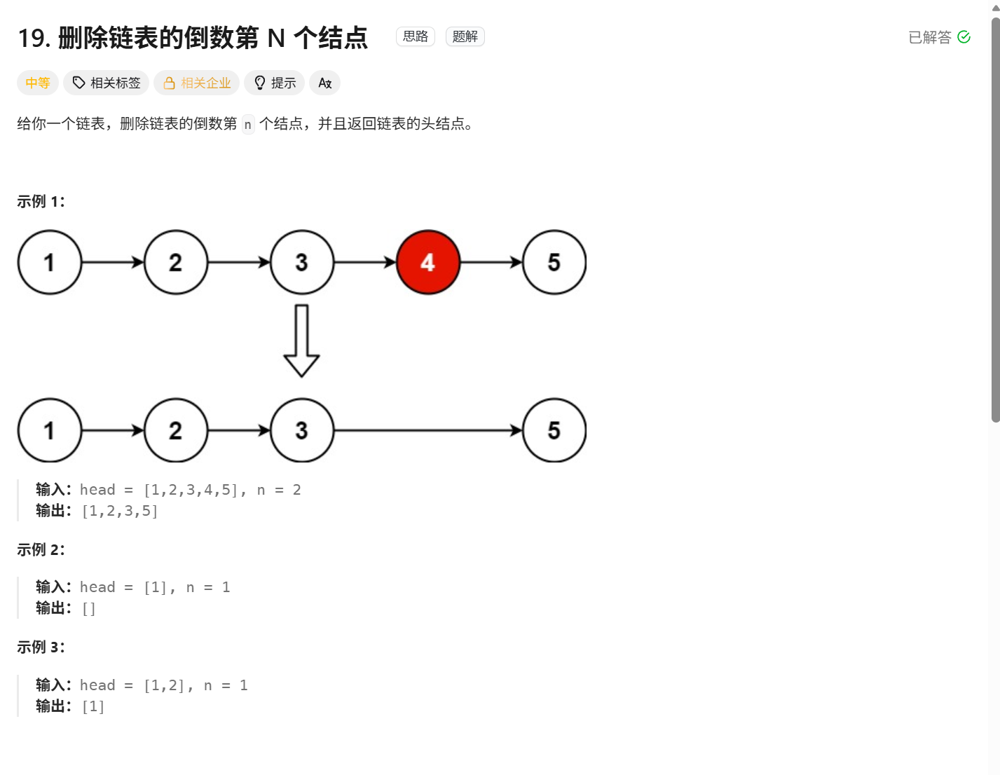
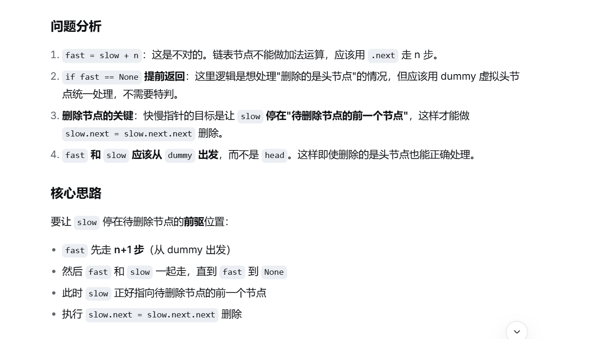
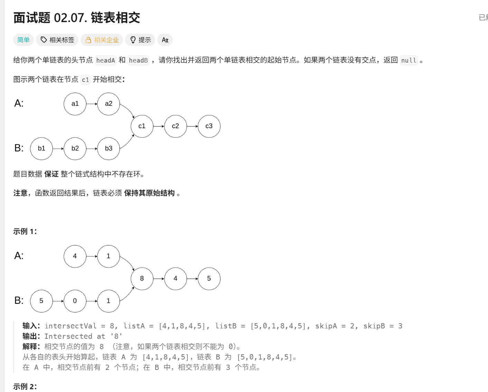
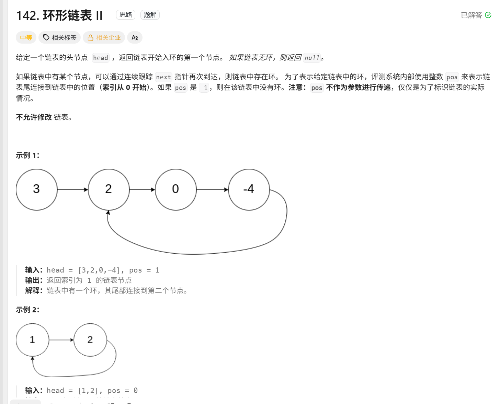
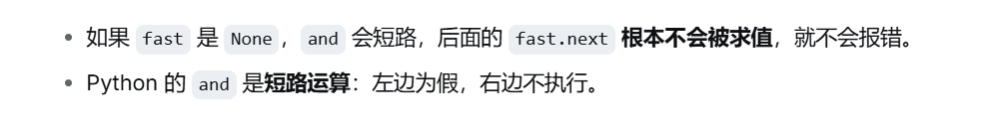

# 列表

列表也是从下标0开始的

虚拟头结点：创建了虚拟头结点就是要用来返回，dumy.next的，虚拟头结点就是为了单独处理这个头结点的，如果不设置虚拟头结点那么你第一个值怎么去执行

交换原则：交换的原则其实就是被赋值的再去给别人赋值就很不正确

```python
        #开始交换
        pre.next=behind
        behind.next=present  交换的原则其实就是被赋值的再去给别人赋值就很不正确
        present.next=behind.next  
```

python的and ： 先处理左边满足才会处理右边




## 移除列表

[203. 移除链表元素 - 力扣（LeetCode）](https://leetcode.cn/problems/remove-linked-list-elements/description/)



### 伪代码

```python
# Definition for singly-linked list.
# class ListNode:
#     def __init__(self, val=0, next=None):
#         self.val = val
#         self.next = next
class Solution:
    #Optional的意思是创建的head可以是指定的ListNode类型，也可以是None
    def removeElements(self, head: Optional[ListNode], val: int) -> Optional[ListNode]:
        
        dummyhead = ListNode(0)#定义一个虚拟的头结点
        dummyhead.next = head #指向链表的头节点
        cur = dummyhead#用来遍历链表
        
        while  cur.next != None:
            if cur.next.val == val:
                cur.next = cur.next.next
            else:
                cur = cur.next
        head = dummyhead.next
        return head
```

### 思路：

创建一个虚拟头指针指向head，因为如果head也是target的话删除的时候一定要知道前一个头指针是什么


##  设计列表


```python
class ListNode:
    def __init__(self, val: int = 0, next: "ListNode" = None): #next: "ListNode"前向引用
        self.val = val      # 节点值
        self.next = next    # 指向下一个节点，默认 None


class MyLinkedList:

    def __init__(self): # 初始化列表
        self.size=0
        self.head=ListNode(0,None)
        

    def get(self, index: int) -> int: #获取下标index的值
        if index<0 or index>=self.size:
            return -1
        
        cur =self.head
        for _ in range(0,index+1): #循环到index取出来 +是右边开的边界
            cur=cur.next
        return cur.val


    def addAtHead(self, val: int) -> None: # 把val这个值插入到第一个元素之前作为新头节点

        self.addAtIndex(0, val)
        

    def addAtTail(self, val: int) -> None: # 把val这个值插入到最后一个元素之前作为末尾节点

        self.addAtIndex(self.size, val)

    def addAtIndex(self, index: int, val: int) -> None:#把val插入到下标index之前
        if index>self.size:
            return 
        index = max(0, index) #也有可能是负数
        self.size += 1
        cur=self.head
        for _ in range(0,index): #index 的节点之前那么就正好 右开就是index 指到上一个节点
            cur=cur.next 

        to_add=ListNode(val,cur.next) #这里是创造新加的节点的值以及指向下一个指针
        cur.next=to_add #把index上一个的next指向 to_add
        

    def deleteAtIndex(self, index: int) -> None: #三处下标
        if index < 0 or index >= self.size:
            return
        self.size -= 1
        pred = self.head
        for _ in range(index):
            pred = pred.next
        pred.next = pred.next.next

 


# Your MyLinkedList object will be instantiated and called as such:
# obj = MyLinkedList()
# param_1 = obj.get(index)
# obj.addAtHead(val)
# obj.addAtTail(val)
# obj.addAtIndex(index,val)
# obj.deleteAtIndex(index)
```

### 思路

先写好addAtIndex其他的插入尾和插入首都可用其实现

### 易错点

记得init 要两个下划线


## 翻转列表

[206. 反转链表 - 力扣（LeetCode）](https://leetcode.cn/problems/reverse-linked-list/description/)




### 伪代码

#### 双指针法

```python
# Definition for singly-linked list.
class ListNode:
    def __init__(self, val=0, next=None):
        self.val = val
        self.next = next

class Solution:
    def reverseList(self, head: ListNode) -> ListNode: 
        pre = None
        cur = head
        temp=None
        
        while cur !=None:
            temp=cur.next #先储存起来next
            cur.next=pre   #把pre给cur
            
            #然后再更新pre和cur的值去进行后续的操作
            pre=cur
            cur=temp
        return pre

```

#### 思路

先用temp储存起来列表的下一个节点（cur.next），然后直接翻转cur.next把他指向之前的节点pre，然后再更新cur和pre


#### 递归法

```python
# Definition for singly-linked list.
# class ListNode:
#     def __init__(self, val=0, next=None):
#         self.val = val
#         self.next = next
class Solution:
    def reverseList(self, head: ListNode | None) -> ListNode | None:
        return self.reverse(head , None)


    def reverse(self,cur:None,pre:None):
        if cur==None:
            return pre
        temp=cur.next
        cur.next=pre
        return self.reverse(temp,cur)  #这里就是简化了双指针的两步 ，cur=temp pre=cur就在这里


```


#### 思路：

和双指针法几乎一致，reverse函数就实现了cur=temp pre=cur，但要实现递归的话，要处理好什么时候递归结果，主函数里面要咋用


## 两两交换列表中的节点

[24. 两两交换链表中的节点 - 力扣（LeetCode）](https://leetcode.cn/problems/swap-nodes-in-pairs/)



### 伪代码：

```python
# Definition for singly-linked list.
# class ListNode:
#     def __init__(self, val=0, next=None):
#         self.val = val
#         self.next = next
class Solution:
    def swapPairs(self, head: ListNode | None) -> ListNode | None:   
        #至少要三个参数，pre节点，present节点，behind节点 
        dummy=ListNode(0,None)
        dummy.next=head

        pre=dummy

        while  pre.next and pre.next.next: #至少交换的对象是要有值的对吧

            present = pre.next #当前节点的值
            behind = pre.next.next #后面节点的值

            #开始交换
            pre.next=behind
            present.next=behind.next             
            behind.next=present

            pre=present

        return dummy.next


'''
如果这样写就大错特错了
            #开始交换
            pre.next=behind
            behind.next=present           交换的原则其实就是被赋值的再去给别人赋值就很不正确
            present.next=behind.next  
            
            

''''


```


### 思路：

就是要注意怎么交换的，不要交换反了

## 删除列表的倒数第n个节点

[19. 删除链表的倒数第 N 个结点 - 力扣（LeetCode）](https://leetcode.cn/problems/remove-nth-node-from-end-of-list/)




### 我原本的思路是如此

```python
# Definition for singly-linked list.
# class ListNode:
#     def __init__(self, val=0, next=None):
#         self.val = val
#         self.next = next
class Solution:
    def removeNthFromEnd(self, head: ListNode | None, n: int) -> ListNode | None:

        demmy=ListNode(0,head)
        fast=slow=head  #快慢指针同时出发 让fast指针找到最后的值，然后在slow去寻找倒数第n个

        fast=slow+n
        if fast==None:
            return!!!!!!!!!!!!!!!!!!!!!!!!!!

        while fast!=None:
            
            
            
            
            
            
1 <= n <= sz在提示里面有

```




### 可运行伪代码

```python
# Definition for singly-linked list.
# class ListNode:
#     def __init__(self, val=0, next=None):
#         self.val = val
#         self.next = next
class Solution:
    def removeNthFromEnd(self, head: ListNode | None, n: int) -> ListNode | None:

        demmy=ListNode(0,head)
        fast=slow=demmy  #快慢指针同时出发 让fast指针找到最后的值，然后在slow去寻找倒数第n个

        #fast到达比slow快n+1的地方
        for _ in range(0,n+1): 
            fast=fast.next

        while fast !=None:
            fast=fast.next
            slow=slow.next
        
        #slow抵达倒数第n个节点之后
        slow.next=slow.next.next
        return demmy.next


#1 <= n <= sz在提示里面有

```

### 思路

双指针去找到倒数第n个值，因为列表不好单独寻找倒数的只有正数的可以，所以让fast找到最后一个none的，然后slow删除


## 链表相交

[面试题 02.07. 链表相交 - 力扣（LeetCode）](https://leetcode.cn/problems/intersection-of-two-linked-lists-lcci/)




### 伪代码

```python
# Definition for singly-linked list.
# class ListNode:
#     def __init__(self, x):
#         self.val = x
#         self.next = None

class Solution:
    def getIntersectionNode(self, headA: ListNode, headB: ListNode) -> ListNode:
        if headA is None or headB is None:
            return None
        
        pA, pB = headA, headB
        
        while pA != pB:
            # 如果 pA 走到末尾，就切换到 headB 从头开始；否则继续往下走
            pA = headB if pA is None else pA.next
            # 如果 pB 走到末尾，就切换到 headA 从头开始；否则继续往下走
            pB = headA if pB is None else pB.next
        
        # 循环结束时：
        # 有交点 → pA == pB == 交点节点
        # 无交点 → pA == pB == None
        return pA
```

### 思路：

如果有交点，那么A从headA开始，到了就直接从headB又开始， B也是同理 ，这样一直同步走就能够找到如果相交的话

终止条件：

无交点：PA和PB把他们两个都走了一遍之后，全都是None了

有交点：


## 环形列表


[142. 环形链表 II - 力扣（LeetCode）](https://leetcode.cn/problems/linked-list-cycle-ii/)



```python
# Definition for singly-linked list.
# class ListNode:
#     def __init__(self, x):
#         self.val = x
#         self.next = None

class Solution:
    def detectCycle(self, head: Optional[ListNode]) -> Optional[ListNode]:

        slow=head
        fast=head

        while fast and fast.next!=None: #如果没有环就碰到了边界 
            #快指针每次走两步，慢指针每次走一步
            fast=fast.next.next
            slow=slow.next

            if fast==slow:#相遇 slow马上回头结点
                slow=head

                while slow!=fast:
                    slow=slow.next
                    fast=fast.next
                return slow

        return None        


      

        
```


### 思路：

太多了，看pdf吧



