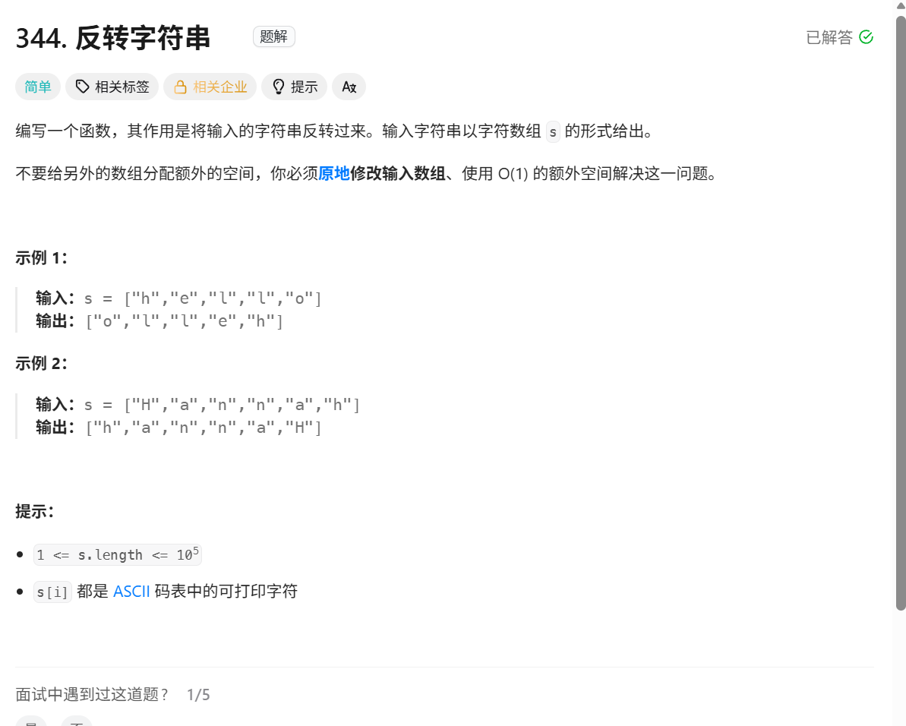
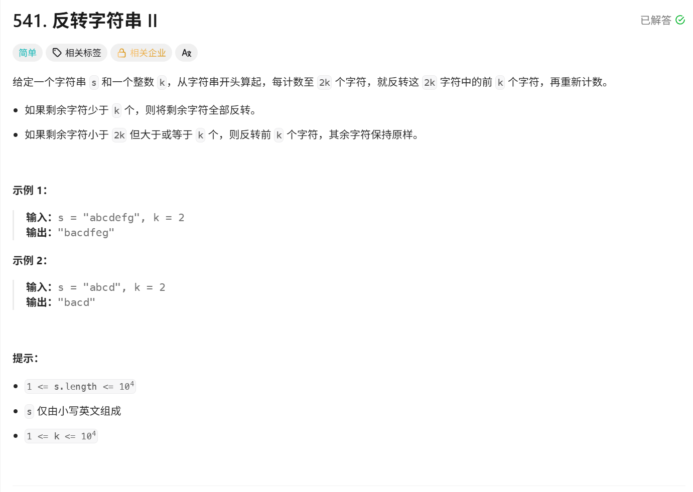
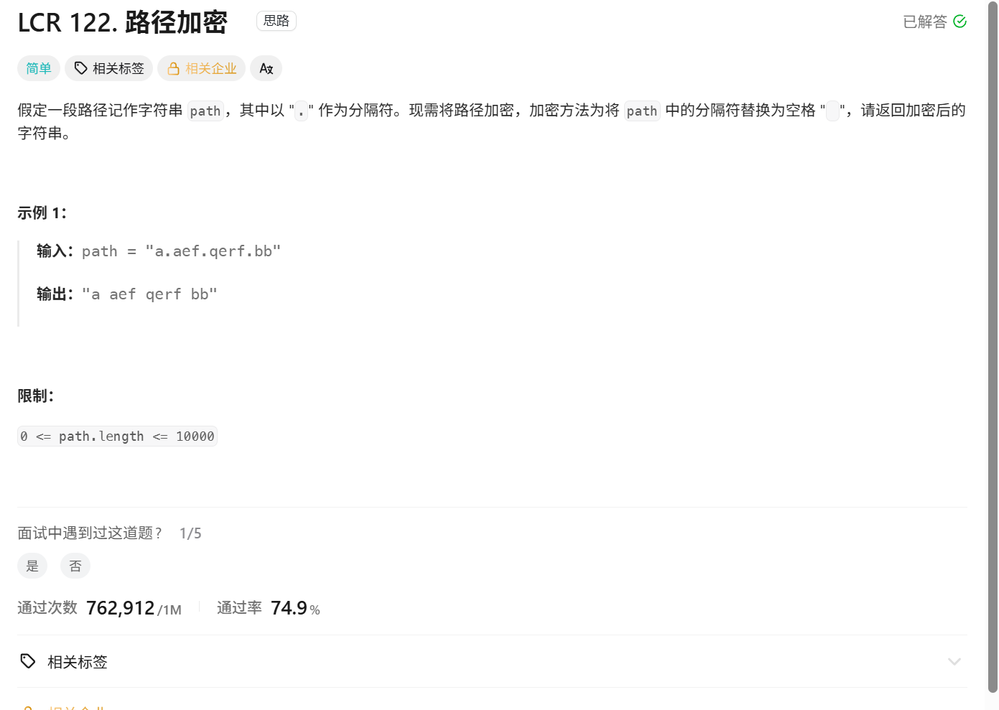
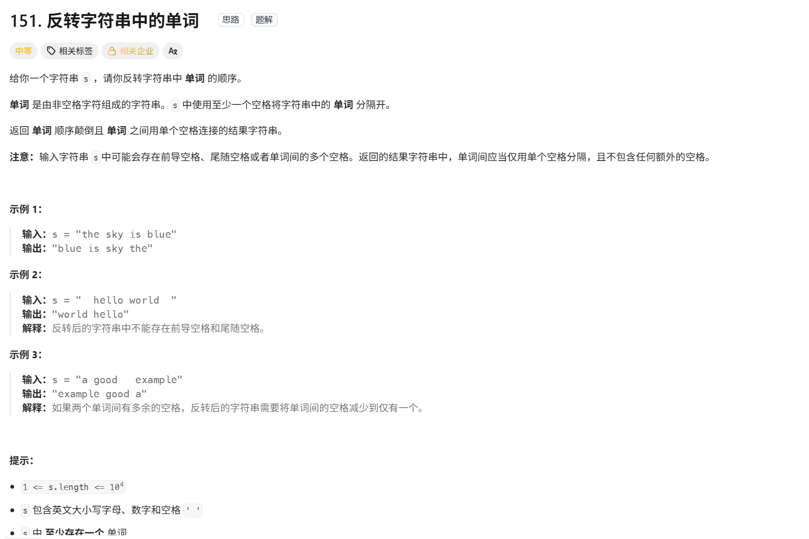
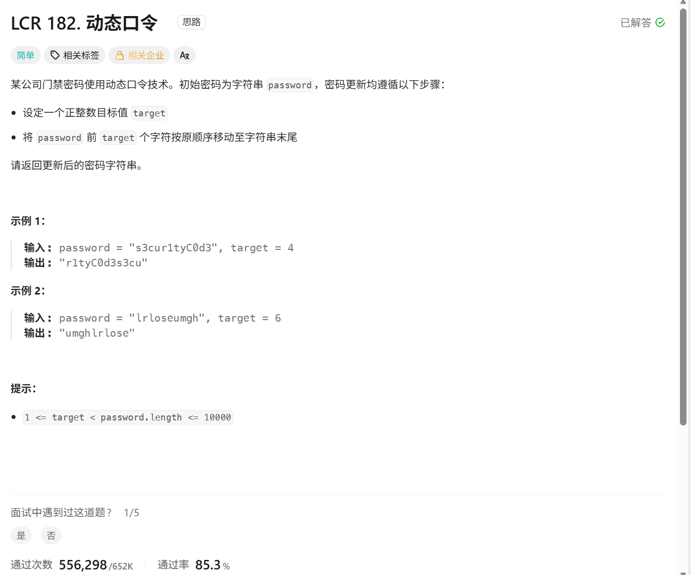
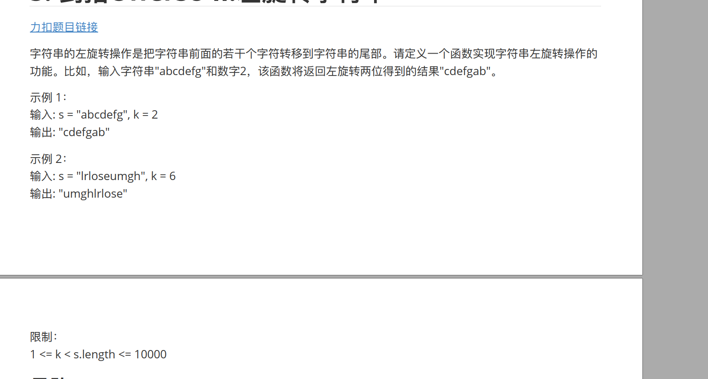

1.字符串不可以直接修改

2.   s【：：-1】

```python
s = "hello"
print(s[::-1])   # olleh

s = "12345"
print(s[::-1])   # 54321

lst = [1, 2, 3, 4]
print(lst[::-1]) # [4, 3, 2, 1]
```


3. spilt和join的用法：

   ```python
   # spilt
   字符串.split(分隔符, 最大切分次数)
       1.不指定分隔符（不指定分隔符时，默认按照空格、多个空格、换行等空白字符切分）
   s = "I love Python"
   result = s.split()
   print(result)#['I', 'love', 'Python']
   
       2.指定分隔符（分隔符会被去掉）
   s = "apple,banana,orange"
   result = s.split(',')
   print(result)#['apple', 'banana', 'orange']
   
       3.指定切分次数（num表示最多切分num次）
   s = "a-b-c-d"
   result = s.split('-', 2)
   print(result)#['a', 'b', 'c-d']
   
       4.与join()配合使用
   s = "hello world python"
   words = s.split()
   result = "-".join(words)
   print(result)#hello-world-python
   
   
   
   
   s = "苹果,香蕉,西瓜"
   fruits = s.split(",")
   print(fruits)
   result = " | ".join(fruits)
   print(result)
   
   # 输出：
   # ['苹果', '香蕉', '西瓜']     
   # 苹果 | 香蕉 | 西瓜
   ```

   

# 1..反转字符串

[344. 反转字符串 - 力扣（LeetCode）](https://leetcode.cn/problems/reverse-string/description/)



### 思路：

用双指针left和right交换即可

### 伪代码：

```python
class Solution:
    def reverseString(self, s: list[str]) -> None:
        """
        Do not return anything, modify s in-place instead.
        """
        n=len(s)
        left=0
        right=n-1
        while right>left:
            temp=s[right]
            s[right]=s[left]      #其实交换可以直接   s[left] , s[right] = s[right] , s[left]       
            s[left]=temp
            right-=1
            left+=1


```


### 注意事项：

1.其实交换可以直接            s[left] , s[right] = s[right] , s[left] 这是python特有的

2.注意这个s是列表并不是字符串


# 2.反转字符串

[541. 反转字符串 II - 力扣（LeetCode）](https://leetcode.cn/problems/reverse-string-ii/)




###  伪代码

```python
class Solution:
    def reverseStr(self, s: str, k: int) -> str:
        #先写一个函数用来把数组内的元素全部反转
        def myreverse(chars):
            left , right = 0 , len(chars) - 1
            while left < right:
                chars[left] , chars[right] = chars[right] , chars[left]
                left += 1
                right -= 1
            return chars

        res = list(s)#因为 Python 中的字符串 str 是不可变对象，不能直接修改其中某个位置的字符
        # python自动截断后面没有到的0 切片越界不会报错  
        for cur in range(0 , len(s) , 2 * k):
            res[cur : cur + k] = myreverse(res[cur : cur + k])
        return ''.join(res)
```


### 思路

1.交换思路是和第一题反转字符串一样的

2.python能自动切片


### 易错点：

1.字符串不可以直接修改，要转化为列表才可以修改

2.在这里 后面是空的时候，python会自动舍去  就自动满足小于k翻转

```python
    # python自动截断后面没有到的0 切片越界不会报错  
    for cur in range(0 , len(s) , 2 * k):
        res[cur : cur + k] = myreverse(res[cur : cur + k])
```


# 3.路径加密

[LCR 122. 路径加密 - 力扣（LeetCode）](https://leetcode.cn/problems/ti-huan-kong-ge-lcof/)




### 伪代码

```python
class Solution:
    def pathEncryption(self, path: str) -> str:
        t=list(path)

        for i in range(0,len(t)) :
            if t[i] =='.':
               t[i] =' '
        return ''.join(t)

```


### 思路


### 易错点：

1. 字符串不能修改还是要转化为Lise列表才能够修改  ，return的时候要加  return ''.join(t)
2. 


# 4.翻转字符串中的单词

[151. 反转字符串中的单词 - 力扣（LeetCode）](https://leetcode.cn/problems/reverse-words-in-a-string/)




### 伪代码

```python
# 第一种方法：  用split分割然后再用join去相加起来
class Solution:
    def reverseWords(self, s: str) -> str:
        s = s.split() #将字符串拆分为单词，里面的空格全部会被去除
        #反转单词
        left , right = 0 , len(s) - 1
        while left < right:
            s[left] , s[right] = s[right] , s[left]
            left += 1
            right -= 1
        return ' '.join(s)
    
    
    
    
  #极其简单的代码法
class Solution:
    def reverseWords(self, s: str) -> str:
        s = s[::-1] #反转整个字符串
        return ' '.join(word[::-1] for word in s.split())
```


### 思路 

新学了一个split可以按照要求分割出来， 然后可以直接分割出来  并且还是按照单词分割的，join就是按什么分割这个单词

```python
# spilt
字符串.split(分隔符, 最大切分次数)
    1.不指定分隔符（不指定分隔符时，默认按照空格、多个空格、换行等空白字符切分）
s = "I love Python"
result = s.split()
print(result)#['I', 'love', 'Python']

    2.指定分隔符（分隔符会被去掉）
s = "apple,banana,orange"
result = s.split(',')
print(result)#['apple', 'banana', 'orange']

    3.指定切分次数（num表示最多切分num次）
s = "a-b-c-d"
result = s.split('-', 2)
print(result)#['a', 'b', 'c-d']

    4.与join()配合使用
s = "hello world python"
words = s.split()
result = "-".join(words)
print(result)#hello-world-python


s = "苹果,香蕉,西瓜"
fruits = s.split(",")
print(fruits)
result = " | ".join(fruits)
print(result)

# 输出：
# ['苹果', '香蕉', '西瓜']     
# 苹果 | 香蕉 | 西瓜
```


### 易错点：


# 5.动态口令


[LCR 182. 动态口令 - 力扣（LeetCode）](https://leetcode.cn/problems/zuo-xuan-zhuan-zi-fu-chuan-lcof/description/)



### 伪代码

```python
#第一种办法： 翻转整个字符串，再把前面的翻转，再把target翻转，注意这个下标
class Solution:
    def dynamicPassword(self, password: str, target: int) -> str:

        def myreverse(start,end,password):
            left =start
            right=end
            while right>left:
                password[left],password[right]=password[right],password[left]
                right-=1
                left+=1

        password=list(password)
        n=len(password)

        myreverse(0,n-1,password)  #先翻转所有字符
        myreverse(n-target,n-1,password) #再反转后面的target个的字符
        myreverse(0,n-1-target,password)
        return "".join(password)

 #第二种办法    列表遍历拼接 （我首先想到的就是这个办法）
    class Solution:
    def dynamicPassword(self, password: str, target: int) -> str:
        res = []
        for i in range(target, len(password)):
            res.append(password[i])
        for i in range(target):
            res.append(password[i])
        return ''.join(res)

# 第三种方法  面试口答法
class Solution:
    def dynamicPassword(self, password: str, target: int) -> str:
        return password[target:] + password[:target]


        
```


### 思路 

### 易错点：


# 6.右旋字符串





### 伪代码

```python
#第一种方法获取输入的数字k和字符串
k = int(input())
s = input()

print(s[-k:] + s[:-k])


#第二种方法：三次翻转字符串  和上一题动态口令一致
```


### 思路 

### 易错点：


# 7.找出字符串中第一个匹配项的下标

[28. 找出字符串中第一个匹配项的下标 - 力扣（LeetCode）](https://leetcode.cn/problems/find-the-index-of-the-first-occurrence-in-a-string/description/)

### 伪代码

```python

```


### 思路 

### 易错点：


# 8.重复的子字符串

[459. 重复的子字符串 - 力扣（LeetCode）](https://leetcode.cn/problems/repeated-substring-pattern/description/)


### 伪代码

```python

```


### 思路 

### 易错点：


### 伪代码


### 思路 

### 易错点：