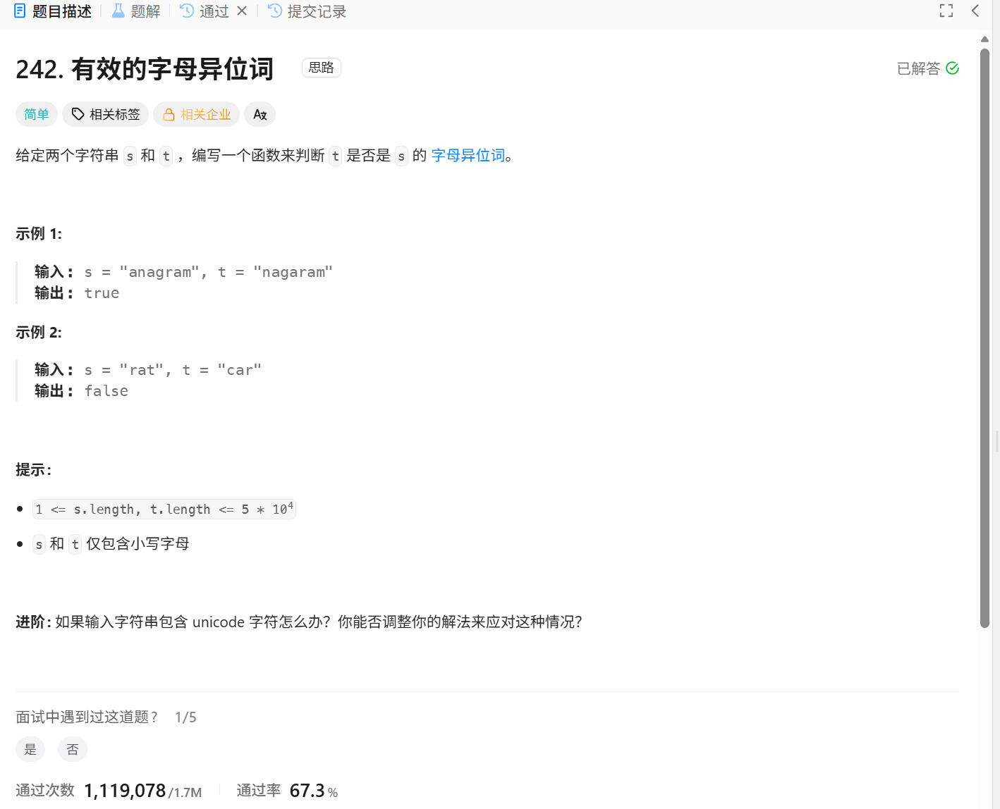
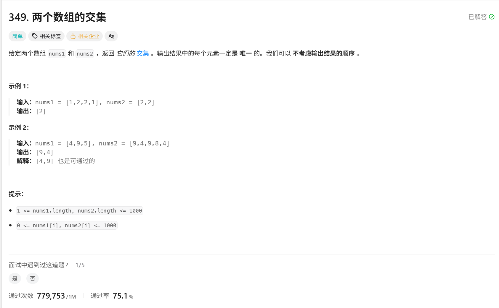
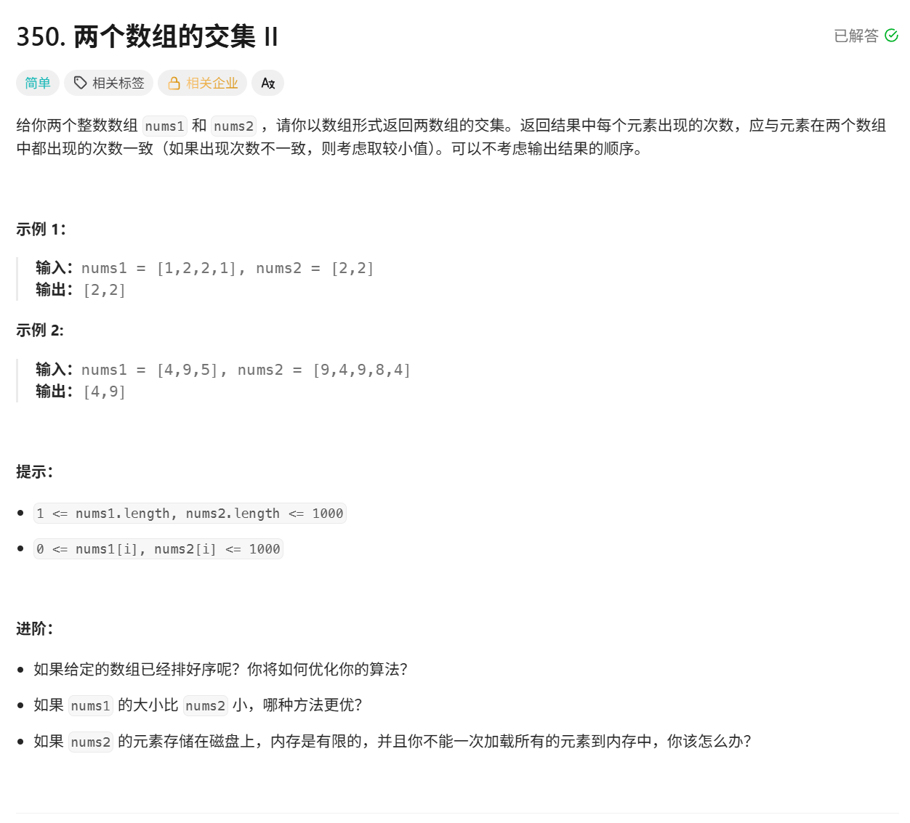
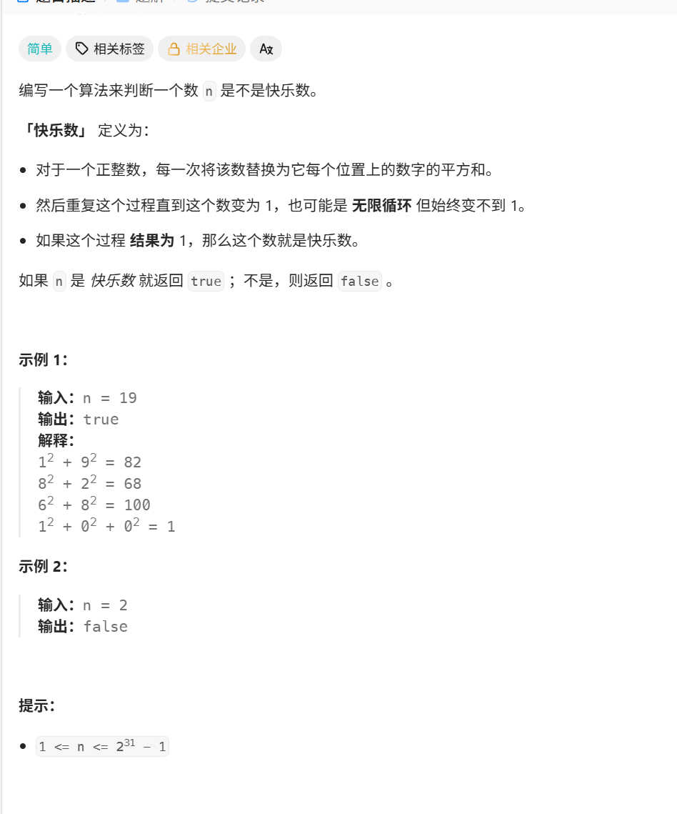
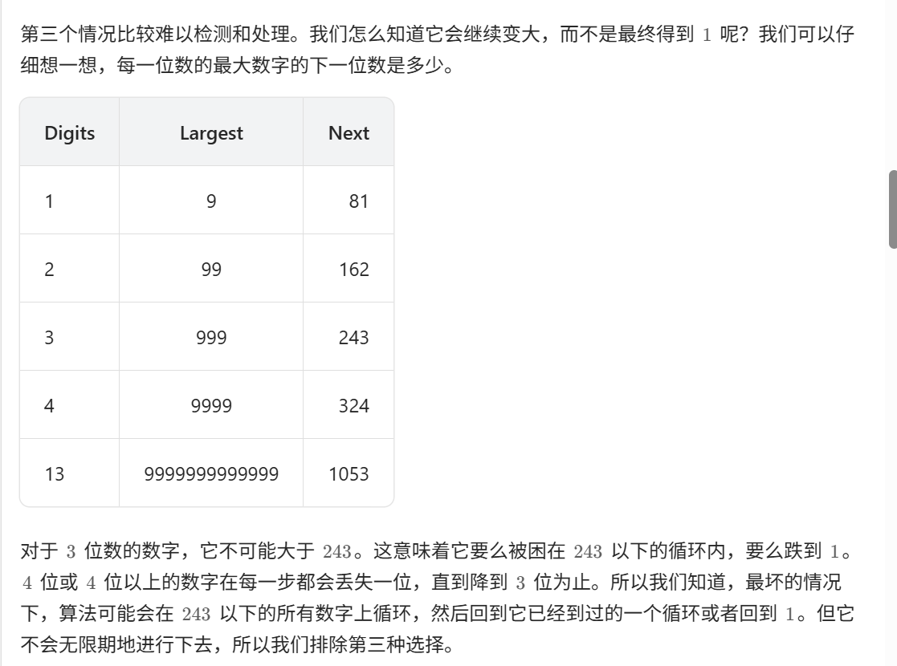
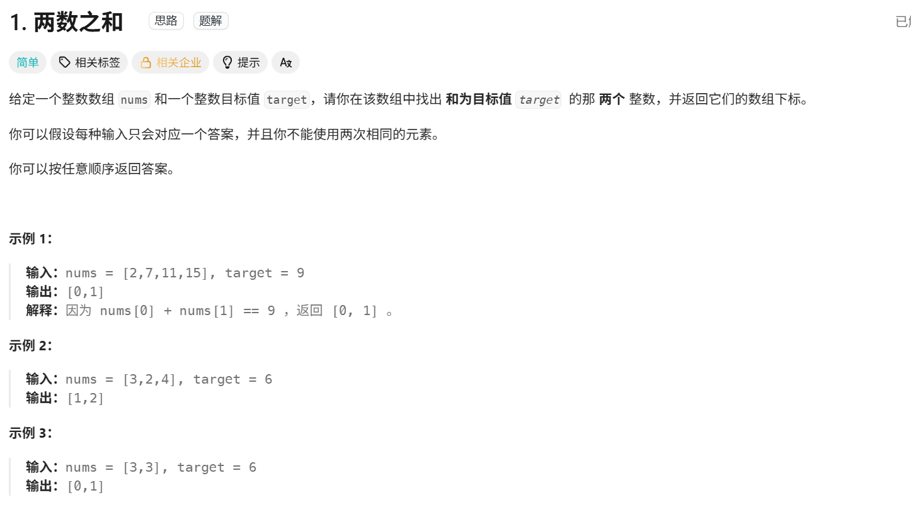

1.判断一个变量是否在哈希表中直接  if a in hash：

2.当我们需要查询⼀个元素是否出现过，或者⼀个元素是否在集合⾥的时候，就要第⼀时间想到哈希法  

3. 字典赋值是这样去赋值的  seen[nums[i]]=i   seen是字典， nums【i】是key

4. 字典就是map 定义方法：  seen=dict() #又要存储数值又要存储下标即可或者  seen={ }  return [seen[target-nums[i]],i]  第一个是键值，第二个是数值，键值不重复，数值可以重复


# 有效的字母异位词




### 使用数组的方法：

```python
#第一种写法
class Solution:
    def isAnagram(self, s: str, t: str) -> bool:
        record=[0]*26

        for char in s:
            record[ord(char)-ord('a')]+=1
        for char in t:
            record[ord(char)-ord('a')]-=1

        for char in record :
            if char!=0:
                return False
        
        return True
    
    
    
    ##第二种写法
    class Solution:
    def isAnagram(self, s: str, t: str) -> bool:
        record=[0]*26

        for char in range(0,len(s)):
            record[ord(s[char])-ord('a')]+=1
        
        for char in range(0,len(t)):
            record[ord(t[char])-ord('a')]-=1            
        
        for char in range(0,len(record)):
            if record[char]!=0:
                return False
        return True

        
```


思路：

就是开辟一个数组去记录s和t里面的每个字母个数，然后对应的字母个数+1 ，然后再验证是否等于0即可


注意事项：

 1 .python里面的数组开辟：   record=[0]*26

2.  for char in s   就是s里面的字符 直接ord （char）就能知道字符的大小，  

    for char in range（len(s)）  要ord（s[char]) 就能知道字符的大小

   3. python里面是ord 字符转化为大小的


### 使用集合的方法

```python
class Solution:
    def intersection(self, nums1: List[int], nums2: List[int]) -> List[int]:
        #set(nums),将nums转换为集合
        #集合内的元素不可重复，两个集合之间可以进行取交集操作，取并集的操作
        #  集合1  &  集合2  =可以取出两个集合的交集
        #  集合1  |  集合2  =可以取出两个集合的并集
        #  list() 可以将括号内的数据类型转换为字典类型
        return list(set(nums1) & set(nums2))
```


# 两个数组的交集


[349. 两个数组的交集 - 力扣（LeetCode）](https://leetcode.cn/problems/intersection-of-two-arrays/description/)





```python

# 第一种写法
class Solution: # 没给定大小的时候用集合好一点
    def intersection(self, nums1: List[int], nums2: List[int]) -> List[int]:
        result_set = set()       # 存放结果，自动去重
        nums_set = set(nums1)    # 将 nums1 转成集合

        for num in nums2:
            if num in nums_set:
                result_set.add(num)

        return list(result_set)
    
    
 #第二种写法
   

class Solution: #如果给定了大小的话可以用数组来储存然后判断
    def intersection(self, nums1: List[int], nums2: List[int]) -> List[int]:
        record=[0]*1005
        result_set=set() 

        for i in nums1:
            record[i]=1
        
        for i in nums2:
            if record[i]==1:
                result_set.add(i)
        return list(result_set)

```


思路：

思路一下就想出来额就是用set给他存起来两个num，然后再用set存起来，一开始我就是不知道set怎么定义


注意事项：

因为题目要求返回列表，而我们用集合来去重，所以返回前要转换       return list(result_set)


# 两指针交集II

[350. 两个数组的交集 II - 力扣（LeetCode）](https://leetcode.cn/problems/intersection-of-two-arrays-ii/)




### 伪代码

```python
class Solution:
    def intersect(self, nums1: list[int], nums2: list[int]) -> list[int]:
        record = [0]*1005
        size=0
        record_result=[0]*1005

        for i in nums1:
            record [i] +=1
        
        for i in nums2:
            if record[i]!=0:
                record[i]-=1          #！！！！！！把合并的删掉一个！！！11
                record_result[size]=i
                size+=1           

        return record_result[0:size]

            
```


思路：

和上一个数组的交集类似，但是要定义一个数组去返回，把size作为变量记录有多少个


# 快乐数

[202. 快乐数 - 力扣（LeetCode）](https://leetcode.cn/problems/happy-number/)



伪代码：

```python
class Solution:
    def isHappy(self, n: int) -> bool:

        seen=set()
        
        def jisuan(n)->int:  #为啥要写函数是因为后面肯定要做一直用我还以为要实现递归呢
            total=0
            while n>0:
                ge=n%10
                total=total+ge*ge
                n=n//10
            return total
        
        while n!=1 and n not in seen:
            seen.add(n)
            n=jisuan(n)


        return n==1

```


思路：

根据我们的探索，我们猜测会有以下三种可能。

1. 最终会得到 1。
2. 最终会进入循环。
3. 值会越来越大，最后接近无穷大。 

第三种可能排除如下：




# 两数之和

[1. 两数之和 - 力扣（LeetCode）](https://leetcode.cn/problems/two-sum/)




伪代码：

```python
# 哈希表算法 ，
class Solution:
    def twoSum(self, nums: list[int], target: int) -> list[int]:
        seen=dict() #又要存储数值又要存储下标
        for i in range(len(nums)):
            if target-nums[i] in seen :
                return [seen[target-nums[i]],i]
            seen[nums[i]]=i

        return []

    
    #暴力算法
class Solution:
    def twoSum(self, nums: List[int], target: int) -> List[int]:
        n = len(nums)
        for i in range(n):
            for j in range(i + 1, n):
                if nums[i] + nums[j] == target:
                    return [i, j]
        
        return []


```


思路：

当时的思路是：从nums遍历，然后从后面开始找targe，也就是暴力解法

从nums开始遍历，如果target- 当前值不在map中 ，那就继续存储，直到遍历结束