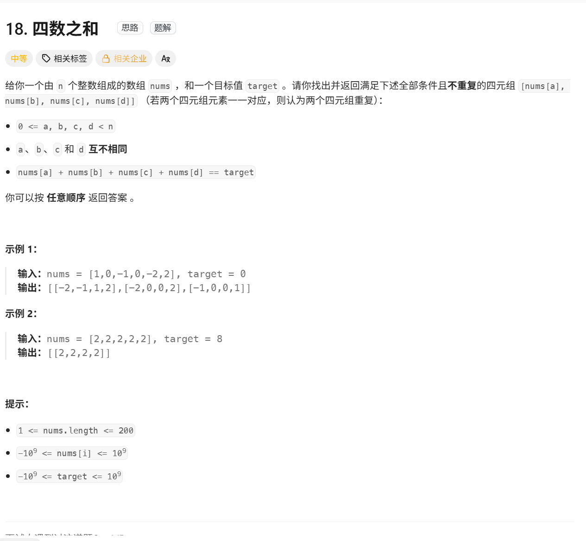
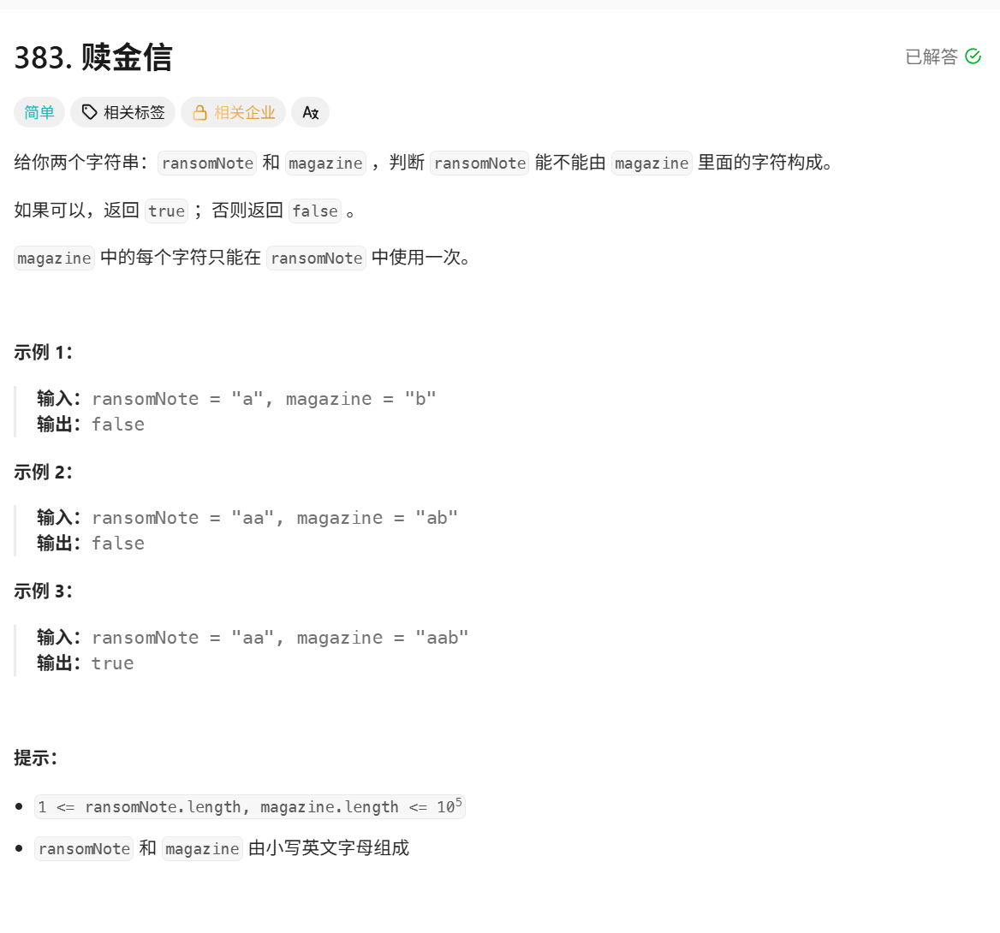
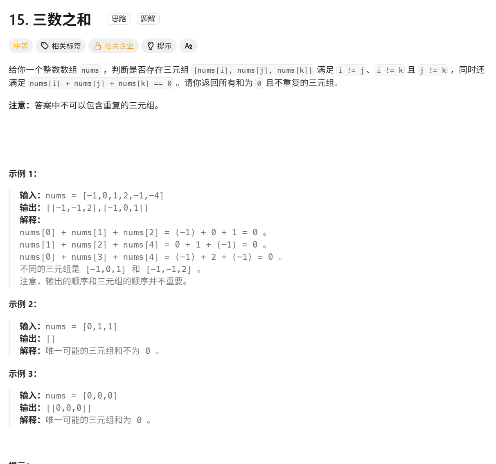
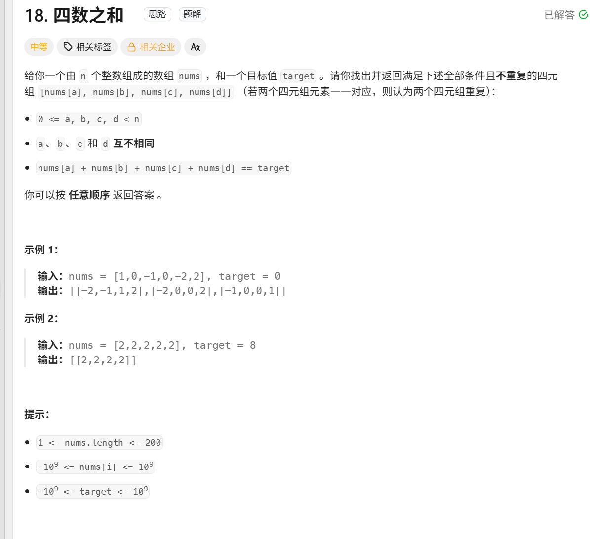

0. 是否重复，去寻找值   这些一定要想到哈希


1.判断一个变量是否在哈希表中直接  if a in hash：


2.当我们需要查询⼀个元素是否出现过，或者⼀个元素是否在集合⾥的时候，就要第⼀时间想到哈希法  

当我们需要查询⼀个元素是否出现过，或者⼀个元素是否在集合⾥的时候，就要第⼀时间想到哈希法  

当我们需要查询⼀个元素是否出现过，或者⼀个元素是否在集合⾥的时候，就要第⼀时间想到哈希法  

当我们需要查询⼀个元素是否出现过，或者⼀个元素是否在集合⾥的时候，就要第⼀时间想到哈希法  


3. 字典赋值是这样去赋值的  seen[nums[i]]=i   seen是字典， nums【i】是key

4. 字典就是map 定义方法：  seen=dict() #又要存储数值又要存储下标即可或者  seen={ }  return [seen[target-nums[i]],i]  第一个是键值，第二个是数值，键值不重复，数值可以重复

   

5. ```python
     
                                                          set 
                                        
     #  set的定义方法： 
       result_set = set()       # 存放结果，自动去重
       nums_set = set(nums1)    # 将 nums1 转成集合
      
      
        
    # 在不在集合中这样判断
        if number in nums1_set:
            
   # 在集合中添加一个数
      result_set.add(number)
   
       
   # 判断一个数在不在 
       while n!=1 and n not in seen
      
   ```


6.

```python
 											dict (map)
  #字典的定义方法：
  seen= dict()
 
# map or dict 添加数字的方法
 seen.add(i,nums[i])  #❌️ 字典没有这样定义的add
    
 seen[nums[i]]=i   # ✅️ 直接这样加


# map给数值的方法 不能直接	seen[char]+= 1 因为如果之前没有这个字典的话，就根本找不到
 seen=dict()
   for char in magazine:
     if char not in seen:
         seen[char]=1
       else:
      	seen[char]= seen[char]+1
```


# 1.有效的字母异位词


### 使用数组的方法：

```python
#第一种写法  用他的字母遍历
class Solution:
    def isAnagram(self, s: str, t: str) -> bool:
        record =[0]*26

        for char in s:
            record[ord(char)-ord('a')] +=1
        for char in t:
            record[ord(char)-ord('a')] -=1 

        for number in record :
            if number !=0:
                return False
        return True        
    
    
    
 ##第二种写法  用他的下标遍历
    class Solution:
    def isAnagram(self, s: str, t: str) -> bool:
        record=[0]*26

        for char in range(0,len(s)):
            record[ord(s[char])-ord('a')]+=1
        
        for char in range(0,len(t)):
            record[ord(t[char])-ord('a')]-=1            
        
        for char in range(0,len(record)):
            if record[char]!=0:
                return False
        return True

        
```


思路：

就是开辟一个数组去记录s和t里面的每个字母个数，然后对应的字母个数+1 ，然后再验证是否等于0即可


注意事项：

 1 .python里面的数组开辟：   record=[0]*26

2.  for char in s   就是s里面的字符 直接ord （char）就能知道字符的大小，  

    for char in range（len(s)）  要ord（s[char]) 就能知道字符的大小

   3. python里面是ord 字符转化为大小的


重写一遍之后还是犯错注意的点：

1.用字母遍历的时候去循环record直接用number循环就可以了，不要用字母循环，record里面没有字母


# 2.两个数组的交集


[349. 两个数组的交集 - 力扣（LeetCode）](https://leetcode.cn/problems/intersection-of-two-arrays/description/)


```python

# 第一种写法          用数组储存           用数组储存              用数组储存        用集合储存
class Solution: # 没给定大小的时候用集合好一点
    def intersection(self, nums1: List[int], nums2: List[int]) -> List[int]:
        result_set = set()       # 存放结果，自动去重
        nums_set = set(nums1)    # 将 nums1 转成集合

        for num in nums2:
            if num in nums_set:
                result_set.add(num)

        return list(result_set)
    
    
 #第二种写法         用数组储存      用数组储存          用数组储存                用数组储存

class Solution: #如果给定了大小的话可以用数组来储存然后判断
    def intersection(self, nums1: List[int], nums2: List[int]) -> List[int]:
        record=[0]*1005
        result_set=set() 

        for i in nums1:
            record[i]=1
        
        for i in nums2:
            if record[i]==1:
                result_set.add(i)
        return list(result_set)

```

### 使用集合的方法

```python
class Solution:
    def intersection(self, nums1: List[int], nums2: List[int]) -> List[int]:
        #set(nums),将nums转换为集合
        #集合内的元素不可重复，两个集合之间可以进行取交集操作，取并集的操作
        #  集合1  &  集合2  =可以取出两个集合的交集
        #  集合1  |  集合2  =可以取出两个集合的并集
        #  list() 可以将括号内的数据类型转换为字典类型
        return list(set(nums1) & set(nums2))
```

### 使用数组的方法

```python


class Solution:
    def intersection(self, nums1: List[int], nums2: List[int]) -> List[int]:
        record =[0]*1005
        size=0
        nums1_set=set(nums1)  #把nums1转化为集合自动去重
        nums2_set=set(nums2)  #把nums2转化为集合自动去重

        for number in nums1_set:
            if number in nums2_set:
                record[size]=number
                size+=1

        return record[:size]

```

思路：

思路一下就想出来额就是用set给他存起来两个num，然后再用set存起来，一开始我就是不知道set怎么定义


注意事项：

因为题目要求返回列表，而我们用集合来去重，所以返回前要转换       return list(result_set)


# 3.两指针交集II

[350. 两个数组的交集 II - 力扣（LeetCode）](https://leetcode.cn/problems/intersection-of-two-arrays-ii/)


### 伪代码

```python
class Solution:
    def intersect(self, nums1: list[int], nums2: list[int]) -> list[int]:
        record = [0]*1005
        size=0
        record_result=[0]*1005

        for i in nums1:
            record [i] +=1
        
        for i in nums2:
            if record[i]!=0:
                record[i]-=1          #！！！！！！把合并的删掉一个！！！11
                record_result[size]=i
                size+=1           

        return record_result[0:size]

            
```


思路：

和上一个数组的交集类似，但是要定义一个数组去返回，把size作为变量记录有多少个

重写之后犯的错  第11行就应该是！=0 而不是 ==1 ，被上一题误导了


# 4.快乐数

[202. 快乐数 - 力扣（LeetCode）](https://leetcode.cn/problems/happy-number/)


### 伪代码：

```python
class Solution:
    def isHappy(self, n: int) -> bool:

        seen=set()
        
        def jisuan(n)->int:  #为啥要写函数是因为后面肯定要做一直用我还以为要实现递归呢
            total=0
            while n>0:
                ge=n%10
                total=total+ge*ge
                n=n//10
            return total
        
        while n!=1 and n not in seen:
            seen.add(n)
            n=jisuan(n)


        return n==1

```


### 思路：

根据我们的探索，我们猜测会有以下三种可能。

1. 最终会得到 1。
2. 最终会进入循环。
3. 值会越来越大，最后接近无穷大。 

第三种可能排除如下：


### 再写一遍之后犯下的错误：

return的时候写  return n==1  ，因为while的判断条件是 n not in seen或者n ==1  ，


# 5.两数之和

[1. 两数之和 - 力扣（LeetCode）](https://leetcode.cn/problems/two-sum/)


伪代码：

```python
# 哈希表算法 ，
class Solution:
    def twoSum(self, nums: list[int], target: int) -> list[int]:
        seen=dict() #又要存储数值又要存储下标
        for i in range(len(nums)):
            if target-nums[i] in seen :
                return [seen[target-nums[i]],i]
            seen[nums[i]]=i

        return []

    
    #暴力算法
class Solution:
    def twoSum(self, nums: List[int], target: int) -> List[int]:
        n = len(nums)
        for i in range(n):
            for j in range(i + 1, n):
                if nums[i] + nums[j] == target:
                    return [i, j]
        
        return []
    
    
#缝合怪算法
 class Solution:
    def twoSum(self, nums: list[int], target: int) -> list[int]:
        seen=set()
        a,b=-1,-1
        size=-1

        for i in nums:
            if target-i in seen:
                for j in range(0,len(nums)):
                    if nums[j]==i and size==-1:
                        a=j
                        size=0
                    if nums[j]==target-i:
                        b=j
                return [a,b]
            seen.add(i)
        
   

```


### 思路：

当时的思路是：从nums遍历，然后从后面开始找targe，也就是暴力解法

从nums开始遍历，如果target- 当前值不在map中 ，那就继续存储，直到遍历结束


### 重写一遍之后还会犯的错

1.定义一个字典，第一个key是数值， 第二个value才是下标


# 6.四数相加


[18. 四数之和 - 力扣（LeetCode）](https://leetcode.cn/problems/4sum/description/)




```python
class Solution:
    def fourSumCount(self, nums1: List[int], nums2: List[int], nums3: List[int], nums4: List[int]) -> int:
        
        value=0
        seen=dict() 
        counter =0  #记录出现的次数
        for i in nums1:
            for j in nums2:
                value = i+j

                if value in seen :
                    seen[value]+=1  #seen【value】 是nums1 +nums2的值
                else:
                    seen[value]=1 
        
        for i in nums3:
            for j in nums4:
                value=-i-j
                if value in seen:
                    counter=counter+seen[-i-j]
        return counter

                


```


### 思路：

 就是让nums1和nums2 分成一组 num3和num4分成一组 然后计算两个for循环的 值， 用map记录下来然后 value=-i-j 去找有没有

最重要的一点就是    counter=counter+seen[-i-j]  这样的话就解决了还要来一次的机会

# 7.赎金信

[383. 赎金信 - 力扣（LeetCode）](https://leetcode.cn/problems/ransom-note/description/)




### 伪代码

```python
class Solution:
    def canConstruct(self, ransomNote: str, magazine: str) -> bool:
        seen=dict()
        for char in magazine:
            if char not in seen:
                seen[char]=1
            else:
                seen[char]= seen[char]+1
        
        for char in ransomNote:
            if char not in seen:
                return False
            
            seen[char]= seen[char]-1               

        for i in seen:
            if seen[i] <0:
                return False

        return True
```


### 思路：


和第一个有效的字母异位词差不多，就是直接存储一个字符串，然后另一个一直减去

# 8.三数之和

[15. 三数之和 - 力扣（LeetCode）](https://leetcode.cn/problems/3sum/)




### 伪代码：

```python
#ijk是下标不能相等，结果去重可以理解为i下标对应的值只能用一次，然后去遍历 第一个-1金额第二个-1得出来的结果只能相同
# 【-1，-1，-1,2】 当i是第一个-1的时候往前判断 那么可以得出【-1，-1,2】
#但是i是第二个-1的时候和前面得出来的结果只能一样直接跳过   这是对结果的去重
#

class Solution:
    def threeSum(self, nums: list[int]) -> list[list[int]]:
        
        nums.sort()
        n=len(nums)
        result=[]

        for i in range(0,n-2):
        #因为如果从倒数第三个元素开始nums>0的话根本不可能排序好的三数之和==0了
            if nums[i]>0 :
                break
        #因为如果当前数字和前面的相同，那么就直接跳出来
            if i>0 and nums[i]==nums[i-1]: #i一定要大于0不然没有i-1
                continue


#正式开始判断是否相等
            left=i+1
            right=n-1

            while right>left:
                if nums[i]+nums[right]+nums[left]>0:
                    right-=1
                elif  nums[i]+nums[right]+nums[left]<0:
                    left+=1
                else :
                    #只有相等了之后才需要去重
                    result.append([nums[i],nums[left],nums[right]])

                    while left<right and nums[left]==nums[left+1]:
                        left+=1
                    while left<right and nums[right]==nums[right-1]:
                        right-=1            
           # i和left都固定了right能不固定？得去重， 并且-1，-1,2这种情况的时候，得去重left+1 然后再加1 ，因为第一个-1已经算了进去
                    left+=1
                    right-=1
        return result                 
```


### 思路：

索引不能相等，并不是数值不能相等， num【i】 去重得向前去重，向后去重就忽略了 【-1，-1,2】的情况  。 j k的去重就得往后判断了，因为如果用了-1这种情况然后left+1之后还是-1，所以还要判断一次再去+1


# 9.四数之和

[18. 四数之和 - 力扣（LeetCode）](https://leetcode.cn/problems/4sum/description/)



### 伪代码：

```python
class Solution:
    def fourSum(self, nums: list[int], target: int) -> list[list[int]]:

        result=[]
        nums.sort()
        n=len(nums)
        value=-1
        
        for i in range(0,n-3):
            if i>0 and nums[i]==nums[i-1]:
                continue
            for j in range(i+1,n-2):
                value=nums[i]+nums[j]
                if j>i+1 and nums[j]==nums[j-1]:
                    continue
                left=j+1
                right=n-1

                while right>left:
                    if value+nums[right]+nums[left]>target:
                        right-=1
                    elif value+nums[right]+nums[left]<target:
                        left+=1
                    else :
                        result.append([nums[i],nums[j],nums[left],nums[right]])

                        while right>left and nums[right]==nums[right-1]:
                            right-=1

                        while right>left and nums[left]==nums[left+1]:
                            left+=1
                        left+=1
                        right-=1
        return result


```


### 思路;

和三数之和一模一样的代码，只不过要加一个 j的判定

```python
  for j in range(i+1,n-2):
                value=nums[i]+nums[j]
                if j>i+1 and nums[j]==nums[j-1]:
                    continue
```

