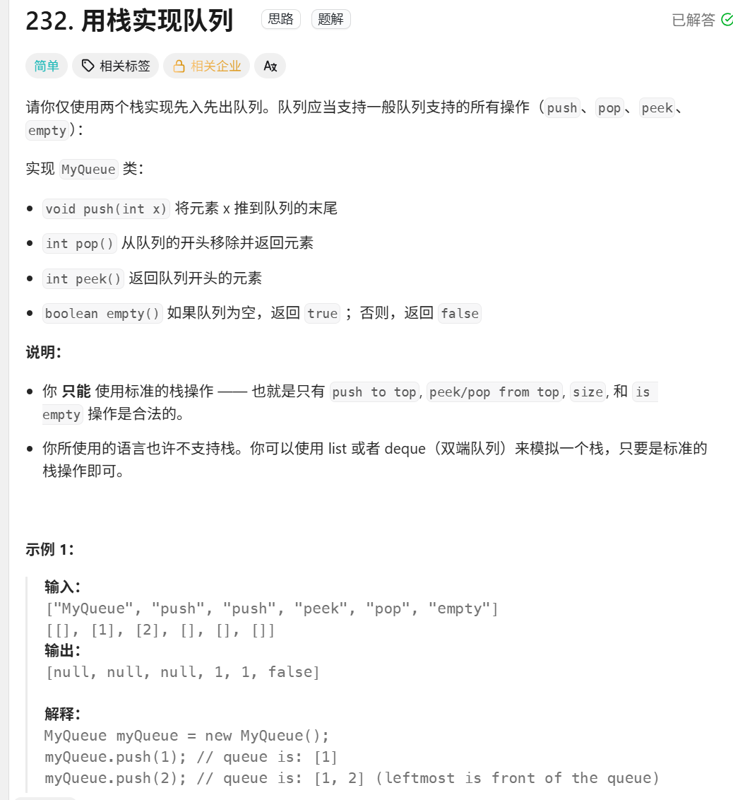
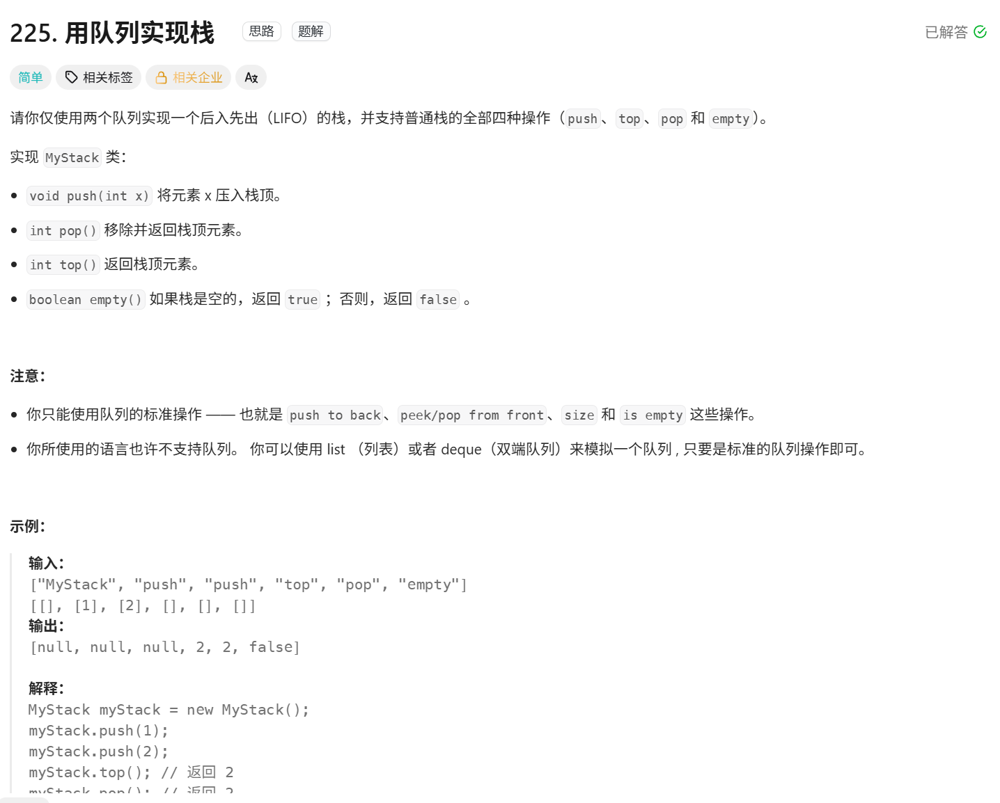
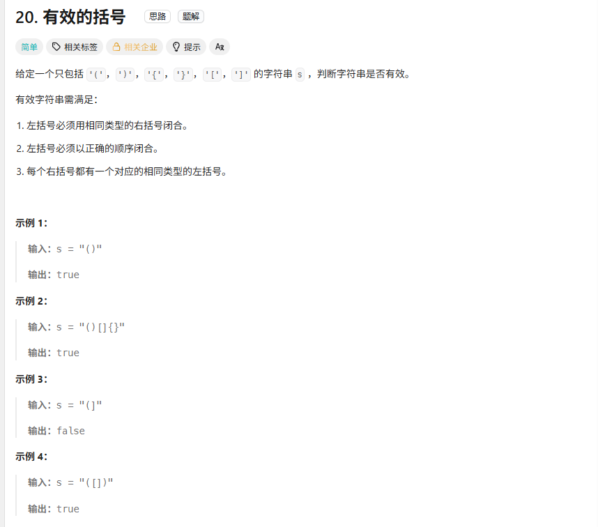
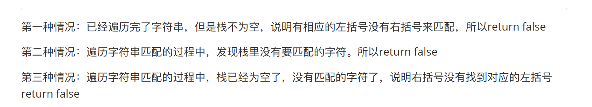
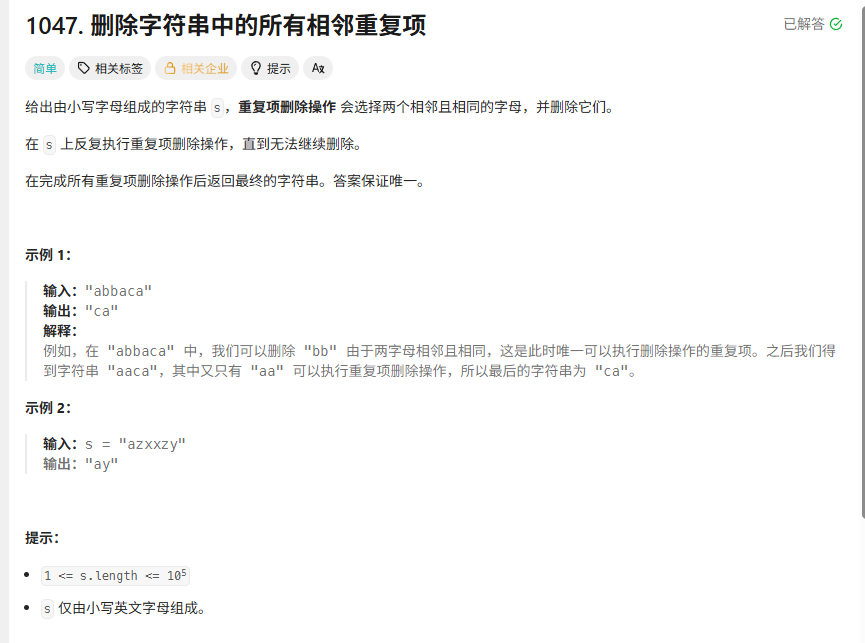
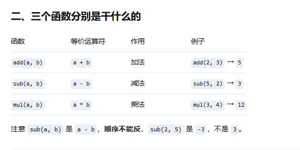
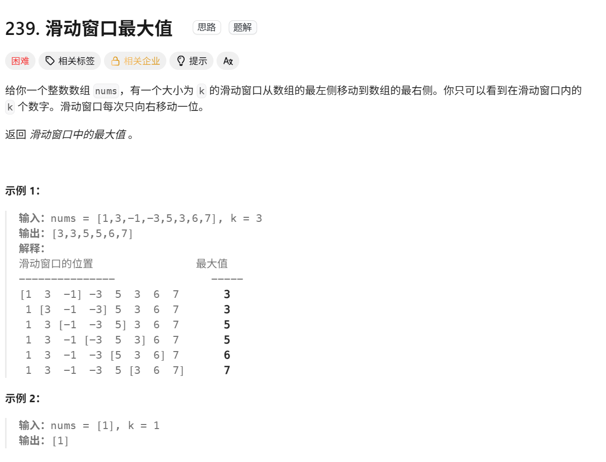
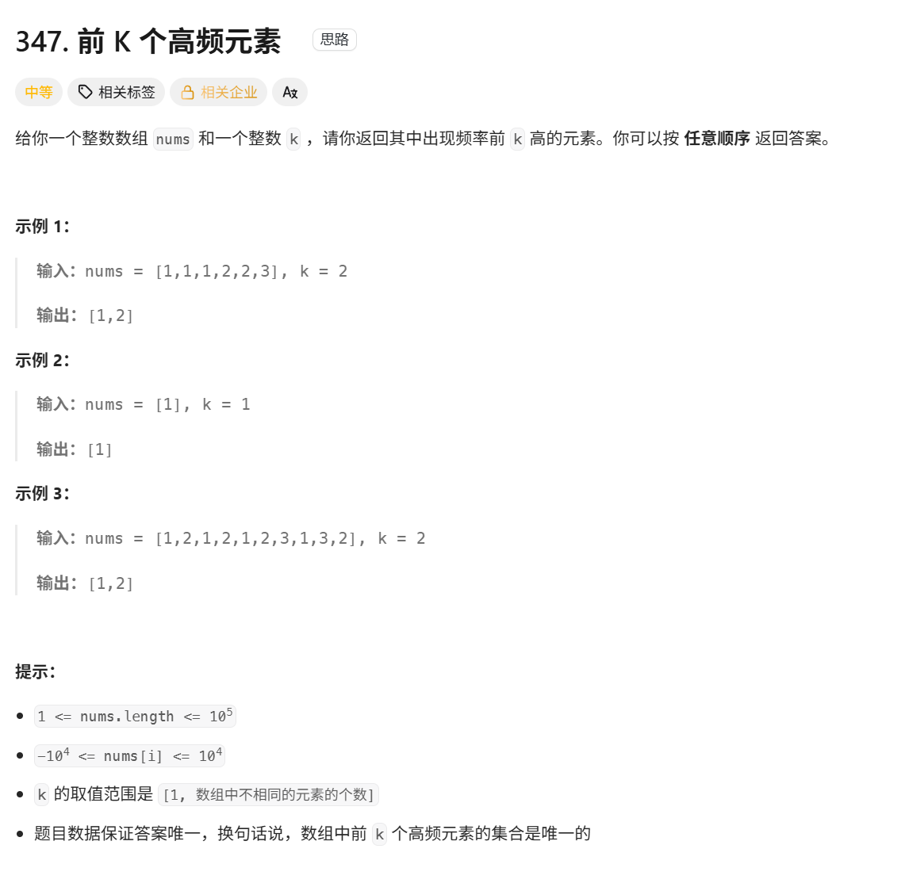

# 栈和队列

**1.判断栈是否为空使用  if not self.stock_in   而不是直接  if  self.stock_in==0 ，因为队列和栈都们本质上是一个容器（集合），而不是数字**

由于栈结构的特殊性，⾮常适合做对称匹配类的题⽬  

2. 定义栈和队列：

   ```python
                                                            栈知识点
   	stack =[]    #栈的定义
       stack[-1]    #从右边开始看，但不删除
       not stack    # 栈是否为空
       stack.append（x） # 把x入栈
       stack.pop()		  # 删除栈顶
       
       
       
       
   
       
   
   														队列知识点
   
   from collections import deque
   # ===== queue：单向（FIFO）=====
   
   q = deque()  #队列定义
   q.append(1)  # 只能从尾部入队
   q.popleft()  # 1，只能从头部出队
   q[0]      	 # 2，看队头
   q[-1]        # 3，看队尾
   
   
   # ===== deque：双向 =====
   dq = deque() 		#队列定义
   dq.append(2)        # 尾部插入
   dq.appendleft(1)    # 头部插入
   dq.popleft()        # 头部删除
   dq.pop()            # 尾部删除
   dq.queue[0]   		#获取队列首值
   
   
   													判断容器是否为空
       if not stack   if queue
   
   
       												字典基础
   q = defaultdict(int)	 #初始化的时候要用int放到括号里
   if ch in pairs:          # 判断 ch 是否为键
   pairs.keys()             # 所有键
   pairs.values()           # 所有值
   pairs.items()            # 所有 (键, 值) 二元组
   for key, value in pairs.items():  #遍历二元组
       print(key, value)
   ```
   
   

## 遇到栈和队列题，可以按下面顺序快速判断：

1. 是否存在“最近打开的先处理”或“后进先出”？优先考虑栈；
2. 是否存在“先进先出”？考虑队列；
3. 是否需要两端操作？考虑 `deque`；
4. 是否要在滑动过程中保持最大/最小候选？考虑单调队列；
5. 是否要动态维护最小的 K 个或最大的 K 个？考虑堆；
6. 写完后逐项检查：空容器访问、弹出顺序、操作数顺序、边界窗口、结果是否需要转换类型。

## 用栈实现队列

[232. 用栈实现队列 - 力扣（LeetCode）](https://leetcode.cn/problems/implement-queue-using-stacks/solutions/632369/yong-zhan-shi-xian-dui-lie-by-leetcode-s-xnb6/)




### 伪代码

```python
class MyQueue:

    def __init__(self):
        self.stock_in =[]  #定义队列中进来的元素储存
        self.stock_out=[]  # 定义队列中出去的元素储存
        

    def push(self, x: int) -> None:
        self.stock_in.append(x)
        

    def pop(self) -> int: 
        if not self.stock_out : ##
            while self.stock_in:
                self.stock_out.append(self.stock_in.pop())
        return self.stock_out.pop()        


    def peek(self) -> int:
        # 复用 pop 的倒腾逻辑，但不要真正弹出 
        if not self.stock_out:
            while self.stock_in:
                self.stock_out.append(self.stock_in.pop())
        
        # 直接返回输出栈的最后一个元素（即栈顶），不调用 pop()
        return self.stock_out[-1]
        

    def empty(self) -> bool:
                # 只有当两个栈都为空时，整个队列才算空
        return  not self.stock_in  and not self.stock_out  # not  ==0


# Your MyQueue object will be instantiated and called as such:
# obj = MyQueue()
# obj.push(x)
# param_2 = obj.pop()
# param_3 = obj.peek()
# param_4 = obj.empty()
```


### 思路 

用两个栈一个存储一个用来翻转

push实现： 直接append到stock_in当中

pop实现：把stock_in全部pop到stock_out当中

peek实现：和popo同理，不同在于        return self.stock_out[-1]

empty实现：直接判断即可

### 易错点：

**判断栈是否为空使用  if not self.stock_in   而不是直接  if  self.stock_in==0 ，因为队列和栈都们本质上是一个容器（集合），而不是数字**

### 知识点


### 重写一遍之后还会犯的错


## 用队列来实现栈

[225. 用队列实现栈 - 力扣（LeetCode）](https://leetcode.cn/problems/implement-stack-using-queues/description/)



### 伪代码

```python


class MyStack:

    def __init__(self):
        self.queue = deque()
        

    def push(self, x: int) -> None:
        n=len(self.queue)
        self.queue.append(x)
        for _ in range(0,n):#从左边推出来，然后再加进去就实现了先入后出，要出的话就是出的最后加进来的那个
            self.queue.append(self.queue.popleft())
        

    def pop(self) -> int:    
        return self.queue.popleft()       
   

    def top(self) -> int: #返回栈顶元素，但是不要改变栈的顺序
        return self.queue[0]            

    def empty(self) -> bool:
        return not self.queue       


# Your MyStack object will be instantiated and called as such:
# obj = MyStack()
# obj.push(x)
# param_2 = obj.pop()
# param_3 = obj.top()
# param_4 = obj.empty()
```


### 思路 

**用一个队列来实现栈，就是先把元素放进去，再循环把前面的一个一个从队伍尾部加进去**

### 易错点：

### 知识点：

```python
#deque() 是 Python 中的“双端队列”
#它支持在队列的两端快速添加和删除元素
#1.创建deque队列
queue = deque()
#2.从右端添加元素
queue.append(1)
queue.append(2)
print(queue)#deque([1,2])
#3.从左端添加元素
queue.appendleft(0)
print(queue)#deque([0,1,2])
#4.从右端删除元素
queue.pop()#删除并返回右边元素2
#5.从左端删除元素
queue.popleft()#删除并返回左边元素0
#6. 直接获取队列的首值
return self.queue[0]            

```


### 重写一遍之后还会犯的错


## 有效的括号

[20. 有效的括号 - 力扣（LeetCode）](https://leetcode.cn/problems/valid-parentheses/description/)




### 伪代码

```python
#第一种写法  右括号当键
from collections import deque
class Solution:
    def isValid(self, s: str) -> bool:
        if len(s) % 2 == 1: #能直接结束，实现时间降低
            return False
        
        stack=[]  # 创建一个空栈
        mapping ={")":"(","]":"[","}":"{"}          #创建一个映射字典，左边是键右边是值

        for ch in s:
            if ch in mapping: #右括号就直接开始判断

                if not stack or stack[-1] !=mapping[ch]: #用[] 而不是（）
                    return False
                stack.pop()

            else: #左括号就存入栈当中
                stack.append(ch)
                
        return not stack #还有（（的情况
    
    
#第二种写法   左括号当键
class Solution:
    def isValid(self, s: str) -> bool:
        if len(s) % 2 == 1:
            return False

        stack = []
        mapping = {"(": ")", "[": "]", "{": "}"}

        for ch in s:
            if ch in mapping:
                stack.append(mapping[ch]) #左括号存入开始对比
            else:
                if not stack or stack.pop()!=ch:
                    return False
        return not stack
```


### 思路 

定义一个pair也就是字典类型，先把左边的括号存入栈（先进后出）当中，然后存完之后利用字典的特性， 从右括号开始（中间开始配对），判断栈顶是不是和右括号是一对键值



****

### 易错点：

1.为什么不能从两边开始配对，要从中间开始： s = "()[]{}" 这种情况就不满足呀

3.能否用队列去实现


代码上：

```python
            if ch in pairs: #这里是判断的键而不是值
```

### 知识点：

```python
     由于栈结构的特殊性，⾮常适合做对称匹配类的题⽬
    
    pairs = {
            ")": "(",
            "]": "[",
            "}": "{",
        }

# 这样算是定义了字典 左边是键右边是值  						11111


if ch in pairs: #这里是判断的键而不是值
    
    
    
    写代码三部曲：
    1.看看能不能有些情况不用去执行，直接判断即可
    2.每次做完一定要对原始数据进行处理  stack.pop（）
```


### 重写一遍之后还会犯的错


## 删除字符串中的所有相邻重复项

[1047. 删除字符串中的所有相邻重复项 - 力扣（LeetCode）](https://leetcode.cn/problems/remove-all-adjacent-duplicates-in-string/)





### 伪代码

```python
class Solution:
    def removeDuplicates(self, s: str) -> str:
        stack=[]

        for ch in s :
            if stack and ch == stack[-1]:
                stack.pop()
            else:
                stack.append(ch)
        return "".join(stack)
```


### 思路 

对于相邻元素，你append之前就判断是否和stack【-1】是否一样即可

****

### 易错点：

​      if stack and ch == stack[-1]:   一定要注意是否为空，为空就完蛋了，力扣还是很多判断极限的地方

### 知识点：

```python
"-".join(["c", "a"])      # "c-a"
", ".join(["a", "b", "c"]) # "a, b, c"
"".join(["a", "b", "c"])   # "abc"
" ".join(["hello", "world"]) # "hello world"

```


### 重写一遍之后还会犯的错


## 逆波兰表达式求值

[150. 逆波兰表达式求值 - 力扣（LeetCode）](https://leetcode.cn/problems/evaluate-reverse-polish-notation/description/)


### 伪代码

```python
class Solution:
    def evalRPN(self, tokens: List[str]) -> int:
        
        mapping={ "+": add,"-":  sub , "*":mul, "/":lambda x, y: int(x / y)}
        stack=[]
        for ch in tokens:
            if ch in {"+","-","*","/"} :
                num1=stack.pop()
                num2=stack.pop()
                num3=mapping[ch](num2,num1)
                stack.append(num3)
            else :
                stack.append(int(ch))   #tokens中的都是字符串不是数字所以要转一下
        return stack.pop()      


```


### 思路 

用mapping定义，这样就实现了两个数之前的操作可以冬动态“”+”或者“”-”然后pop两次实现求值

****

### 易错点：

1.左右操作数别写反

2.tokens中的都是字符串，而不是数组所以要转一下  int(ch)

### 知识点：

```python

#11.python函数中的add和sub和mul用法：
add(a,b)
sub(a,b)s
mul(a,b)


#2.lambda
lambda：定义一个短小的函数懒得再去定义函数了

```



### 重写一遍之后还会犯的错


## 滑动窗口最大值

[239. 滑动窗口最大值 - 力扣（LeetCode）](https://leetcode.cn/problems/sliding-window-maximum/)



### 伪代码

```python
class Myqueue:
    def __init__(self):
        self.que=deque()

    def my_pop(self,value):#如果要滑动窗口弹出的值和队列的第一个值一样，那就直接弹出
        if self.que and value ==self.que[0]:
            self.que.popleft()

    
    def my_push(self,value):  #如果滑动窗口新输入的值找到自己的位置，比他小的直接弹出去pop
        while self.que and value >self.que[-1]:       
            self.que.pop()
        self.que.append(value)

    def my_front(self)->int:
        return self.que[0]


class Solution:
    def maxSlidingWindow(self, nums: List[int], k: int) -> List[int]:

        que=Myqueue()
        result=[] #结果数组
        for i in range(0,k): #先存入钱k个值
            que.my_push(nums[i])
        result.append(que.my_front())

        for i in range(k,len(nums)):
            que.my_pop(nums[i-k])  #滑动窗口舍去nums中的最左边的值
            que.my_push(nums[i])   #看下是否要把nums【i】放进去
            result.append(que.my_front())
        
        return result
        
```


### 思路 

**自己定义一个单调队列，（并且是双向队列）**

**定义三个函数： **

**1 pop 如果要退出去的值就是队列里最左边的值，那就直接popleft **

**2.push  ，在push之前比较一下value和que【-1】谁更大，要是value更大就直接扔掉que【-1】然后继续比，直到找到合适的位置**

**3. front 找到 左边最大的值去返回result里面 **


****

### 易错点：

### 知识点：

```python
 自己定义函数的时候 一定要 def __init__ （self）：
1.初始化
2.第一个参数一定是自己
3.外面调用函数的时候一定要记得是自己内置的函数que.函数


数组也可以append  result.append
```


### 重写一遍之后还会犯的错


**result是要用append去接纳的**


## 前k个高频元素

[347. 前 K 个高频元素 - 力扣（LeetCode）](https://leetcode.cn/problems/top-k-frequent-elements/description/)




### 伪代码

```python
class Solution:
    def topKFrequent(self, nums: list[int], k: int) -> list[int]:
        mymap=defaultdict(int)  #用defaultdict去定义就避免了不存在还要去给1
        for i in nums:  #记录键值以及频率
            mymap[i]+=1
        
        pre=[]  #定义一个堆
        for key,freq in mymap.items():  #mymap.items():返回mymap的键值对
            heapq.heappush(pre,(freq,key))

            if len(pre)>k:
                heapq.heappop(pre) # pre放不下了直接把堆顶元素pop掉
            
        result =[0]*k

        for i in range(k-1,-1,-1): #从堆最后开始遍历到最开始0
            result[i]=heapq.heappop(pre)[1]
        return result


```


### 思路 

先用map去记录，然后定义最小堆，每次加入一个值，就pop堆顶，最后用result记录

****

### 易错点：

### 知识点：

```python
 1.最小堆  最大堆
# ========== 手写堆常用函数（伪代码，一行说明） ==========
class MinHeap:
    def __init__(self):                 # 初始化：创建一个空列表当堆
    def __len__(self):                  # 返回堆里元素个数
    def is_empty(self):                 # 判断堆是否为空
    def peek(self):                     # 返回堆顶（最小值），不弹出
    def _parent(self, i):               # 返回索引 i 的父节点索引
    def _left(self, i):                 # 返回索引 i 的左孩子索引
    def _right(self, i):                # 返回索引 i 的右孩子索引
    def _sift_up(self, i):              # 上浮：新元素往上和父节点比，比父小就交换
    def _sift_down(self, i):            # 下沉：堆顶往下和较小的孩子比，比孩子大就交换
    def push(self, value):              # 插入：加到末尾，然后上浮
    def pop(self):                      # 弹出堆顶：堆顶和末尾交换，删末尾，然后下沉
    def build(self, arr):               # 建堆：从最后一个非叶子节点开始依次下沉，O(n)

# ========== heapq 模块常用函数（伪代码，一行说明） ==========
heap是堆

import heapq
heapq.heappush(heap, x)                # 把 x 插入堆 heap
heapq.heappop(heap)                    # 弹出并返回堆顶（最小值）
heapq.heapify(arr)                     # 把普通列表 arr 原地变成堆，O(n)
heapq.heapreplace(heap, x)             # 弹出堆顶，再插入 x
heapq.heappushpop(heap, x)             # 先插入 x，再弹出堆顶
heapq.nlargest(k, arr)                 # 返回 arr 中前 k 大的元素
heapq.nsmallest(k, arr)                # 返回 arr 中前 k 小的元素
heap[0]                                # 查看堆顶（最小值），不弹出


heapq.heappush(heap, (-x, ...))        # 存负数 → 实现最大堆  否则默认最小堆
    
    
2.defaultdict
  dict键不存在的时候不能进行+1的操作，但是defaultdict可以所以其实用defaultdict为首选
    
```


### 重写一遍之后还会犯的错


